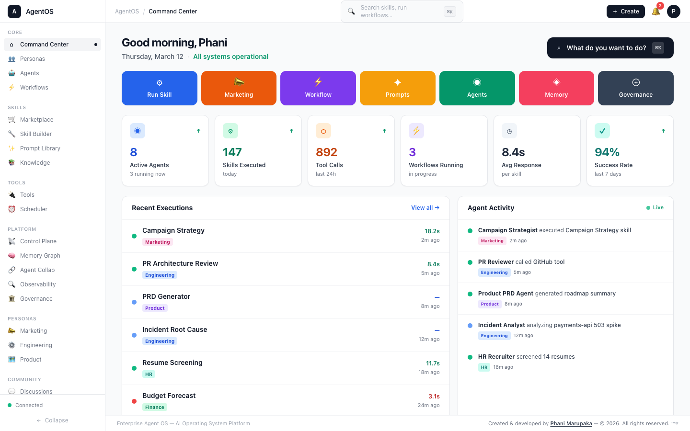
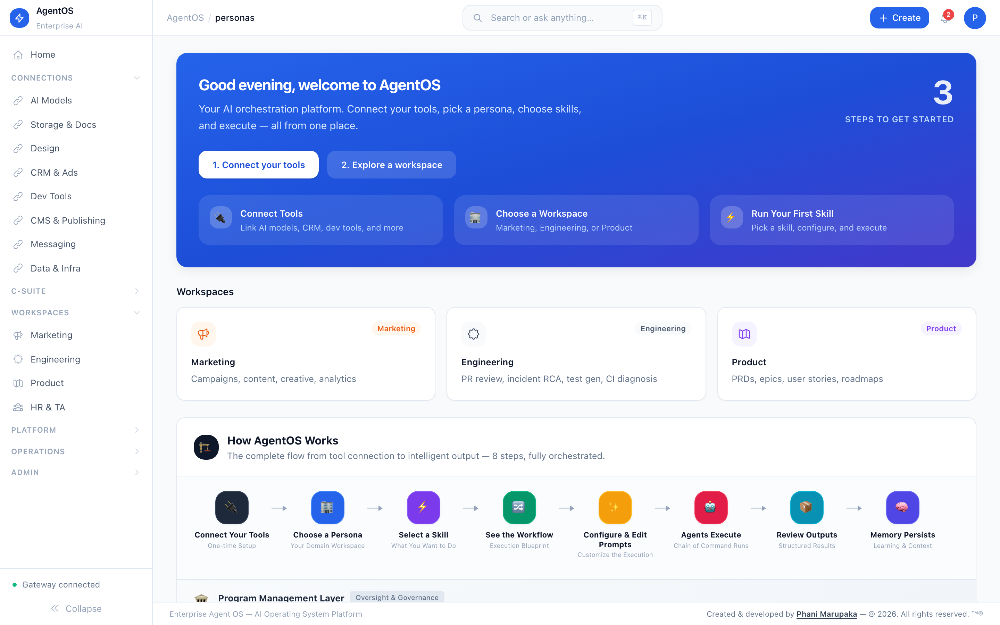

# Enterprise Agent OS

> **The AI Operating System for Enterprise Teams** — 53 autonomous agents across 5 regiments, orchestrating work across 6 persona workspaces through UTCP, A2A, and MCP protocols with full governance, observability, and cost control.

Enterprise Agent OS is a **control plane for enterprise work** — agents think, decide, and orchestrate; tools execute; workflows structure. It doesn't replace your tools — it **orchestrates them through intelligent multi-agent collaboration**.

## Core Architecture

```
User Intent → Intent Engine → Workflow Selection → Agent Orchestration (A2A)
    → Tool Execution (MCP) → Output Aggregation → Human Approval → Memory
```

**Think of it as:** "Kubernetes for Enterprise Workflows" — Agents=Pods, Skills=Containers, Workflows=Deployments, MCP=Service Mesh, UTCP=API Schema.

## Platform Capabilities

| Layer | What It Does |
|-------|-------------|
| **6 Persona Workspaces** | Engineering, Marketing, Product, HR, Talent Acquisition, Program Management |
| **60+ Skills** | Pre-built execution primitives across all personas |
| **53 Agents** | 5 regiments (Titan, Olympian, Asgard, Explorer, Vanguard) with Colonel→Captain→Corporal hierarchy |
| **UTCP Protocol** | Universal Task Context Protocol — standardized packets for every execution |
| **A2A Protocol** | Agent-to-Agent messaging — delegate, query, review, approve, critique, escalate |
| **MCP Tool Layer** | 8 tool adapters (Jira, GitHub, Slack, Confluence, HubSpot, GA4, LinkedIn, Figma) |
| **Agent Meetings** | Standup, sprint planning, retrospective, design review, war room, debrief |
| **Cross-Functional Swarms** | Product launch, incident response, hiring sprint, campaign pods |
| **5 Flagship Workflows** | PRD→Jira, Incident RCA, Campaign Launch, Hiring Pipeline, Launch Readiness |
| **Model Router** | Intelligent routing (Haiku→Sonnet→Opus) with cost metering and circuit breakers |
| **Workflow Canvas** | Visual DAG builder for cross-functional workflow templates |
| **Protocol Monitor** | Real-time UTCP, A2A, MCP, Runtime, and Cost dashboards |
| **Governance** | RBAC, audit trails, compliance checks, cost attribution, budget controls |

## Quick Start

```bash
# Clone and install
git clone https://github.com/Phani3108/Enterprise-Agent-OS.git
cd Enterprise-Agent-OS
pnpm install

# Set up environment
cp deploy/.env.example .env
# Edit .env — add at minimum: ANTHROPIC_API_KEY

# Run gateway + frontend
pnpm dev

# Or use Docker
docker compose -f deploy/docker-compose.production.yml up -d
```

**Frontend:** http://localhost:3010 | **Gateway:** http://localhost:3000 | **Grafana:** http://localhost:3001

---

## Screenshots

### Home & C-Suite Command

<table>
<tr>
<td width="33%">

**Home Command Center** — Mission control with live agent stats, recent executions, and platform health.



</td>
<td width="33%">

**C-Suite Command Center** — 53 agents across Titan, Olympian, Asgard, Explorer, and Eden regiments.


</td>
<td width="33%">

**Vision & Strategy** — Create vision statements, decompose into objectives, cascade to regiments with PMO tracking.


</td>
</tr>
</table>

### Persona Hubs

Each persona hub provides a unified workspace with **Skills → Outputs → Programs → Memory** tabs, a skill configuration form with simulation mode, and a full execution pipeline.

<table>
<tr>
<td width="25%">

**Marketing Hub** — 30 workflows across Campaign, Content, Creative, Event, Research, and Analytics.


</td>
<td width="25%">

**Engineering Hub** — 10 skills across Code Review, Testing, Incident Response, and Documentation.


</td>
<td width="25%">

**Product Hub** — PRD Generator, Jira Epic Writer, User Story Builder, Roadmap Planner, and more.


</td>
<td width="25%">

**HR & Talent Hub** — Recruiting, onboarding, performance reviews, and talent analytics.


</td>
</tr>
</table>

### Platform Intelligence

<table>
<tr>
<td width="33%">

**Agents Panel** — Monitor 53 autonomous agents with status, model, token usage, and success rates.


</td>
<td width="33%">

**AI Courses Hub** — Curated courses from 10 platform providers with engagement tracking.


</td>
<td width="33%">

**Innovation Labs** — Experiment sandbox with hackathons, graduation pipeline, and C-Suite backlog.


</td>
</tr>
<tr>
<td width="33%">

**Budget Intelligence** — Per-agent cost tracking, burn-rate projections, CFO dashboard, and cost alerts.


</td>
<td width="33%">

**Agent Improvement** — Performance reviews, improvement plans, feedback loops, and training exemplars.



</td>
<td width="33%">

**Tool Registry** — Manage integrations (HubSpot, Jira, GitHub, Slack, Salesforce) with auth and capabilities.


</td>
</tr>
</table>

### Operations & Admin

<table>
<tr>
<td width="25%">

**Notification Center** — Multi-channel dispatch (Slack, Teams, Email, Webhook) with rules and delivery logs.


</td>
<td width="25%">

**Executions** — Execution history with status tracking, approval workflows, and after-action reports.


</td>
<td width="25%">

**Discussion Forum** — Threaded discussions with voting, answer acceptance, and community engagement.


</td>
<td width="25%">

**Blog Editor** — Create, publish, and manage blog posts with tags, destinations, and engagement stats.


</td>
</tr>
<tr>
<td width="25%">

**Governance** — License tracking, cost attribution, access management, audit log, and compliance checks.


</td>
<td width="25%">

**Usage & Analytics** — Platform usage stats, adoption metrics, and performance analytics.


</td>
<td width="25%">

**Settings** — Platform configuration, environment variables, and system preferences.


</td>
<td width="25%">

&nbsp;

</td>
</tr>
</table>

---

## Architecture

```
┌─────────────────────────────────────────────────────────┐
│                    Frontend (Next.js 14)                 │
│  Sidebar │ Command Palette │ Main Content │ Right Panel  │
├──────────┴─────────────────┴──────────────┴─────────────┤
│                    Gateway API (Node.js)                 │
│  150+ API routes │ JWT Auth │ Event Bus │ WebSocket      │
├─────────────────────────────────────────────────────────┤
│              Agent Hierarchy (53 Agents)                 │
│  Titan │ Olympian │ Asgard │ Explorer │ Eden Regiments   │
├─────────────────────────────────────────────────────────┤
│  C-Suite Layer │ Vision/PMO │ Innovation │ Budget/Cost   │
├─────────────────────────────────────────────────────────┤
│  Persistence: File-backed │ PostgreSQL │ In-Memory       │
│  Event Bus │ Notification Dispatch │ Webhook Connector   │
├─────────────────────────────────────────────────────────┤
│  Connectors: Jira │ GitHub │ Slack │ Teams │ HubSpot    │
└─────────────────────────────────────────────────────────┘
```

### Organizational Hierarchy

```
Board / Vision Layer
  └── CEO (Supreme Commander — Titan Regiment)
       ├── CMO → Olympian Regiment (Marketing)
       ├── CTO → Asgard Regiment (Engineering)
       ├── CPO → Explorer Regiment (Product)
       ├── CHRO → Eden Regiment (HR & Talent)
       ├── CFO → Budget Intelligence
       └── PMO → Program Management Office
```

### Core Principles

```
Vision → Decomposition → Cascading → Agent Assignment → Skill Execution
     → Output Aggregation → Human Review → After-Action Reports → Learning
```

---

## Features

### Core Platform
- **53 Autonomous Agents** — organized across 5 regiments (Titan, Olympian, Asgard, Explorer, Eden)
- **Military Hierarchy** — General → Field Marshal → Colonel → Captain → Corporal chain of command
- **150+ API Routes** — fully implemented backend with real persistence
- **JWT Authentication** — role-based access control with persona gating
- **Event Bus** — in-process pub/sub with pattern matching and notification dispatch
- **WebSocket Streaming** — live execution updates pushed to the frontend
- **Three-Tier Persistence** — File-backed JSON (default), PostgreSQL, or In-Memory

### C-Suite & Vision Layer
- **C-Suite Command Center** — CEO, CMO, CTO, CPO, CHRO command their regiments
- **Vision & Strategy** — Create vision statements, LLM-powered decomposition into objectives
- **Cascading** — objectives cascade from C-Suite → regiment → agents
- **PMO Dashboard** — program management with cross-regiment status rollups

### Persona Hubs (4 domains)
- **Marketing** — 30 workflows across Campaign, Content, Creative, Event, Research, Analytics
- **Engineering** — 10 skills: PR Review, Unit Tests, Incident RCA, Architecture Review, etc.
- **Product** — 10 skills: PRD Generator, Jira Epics, User Stories, Roadmaps, etc.
- **HR & Talent** — Recruiting, onboarding, performance reviews, talent analytics

### Innovation Labs
- **Experiment Sandbox** — create, activate, evaluate, and graduate experiments
- **Hackathon Mode** — time-boxed innovation sprints linked to experiments
- **Graduation Pipeline** — promote successful experiments to production with review

### Budget & Cost Intelligence
- **Per-Agent Budgets** — allocate monthly/quarterly/annual budgets per agent
- **Spend Tracking** — every API call logged with cost, tokens, model, and latency
- **Burn Rate Analysis** — daily/weekly averages, month-end projections, trend detection
- **Cost Alerts** — threshold, overspend, and spike alerts with severity levels
- **CFO Dashboard** — total budget/spent, by-regiment breakdown, top spenders, cost by provider/model

### Agent Training & Continuous Improvement
- **Performance Reviews** — scored across reliability, efficiency, quality, collaboration, cost-effectiveness
- **Improvement Plans** — objective-based plans with metric tracking and auto-completion
- **Feedback Loops** — positive/negative/correction feedback with sentiment trend analysis
- **Training Exemplars** — curated exemplary/good/cautionary executions for agent learning
- **Health Reports** — agents needing attention, outcome distributions, feedback sentiment

### Notifications & Webhooks
- **Multi-Channel Dispatch** — Slack, Teams, Email, Webhook
- **Rule Engine** — trigger-based notification routing with pattern matching
- **Webhook Connector** — inbound/outbound with HMAC-SHA256 signature verification
- **Delivery Logs** — full audit trail of every notification sent

### Platform Operations
- **Skill Marketplace** — CRUD with voting, comments, analytics, and governance
- **Scheduler** — cron, interval, event-driven, and one-time job scheduling
- **Discussion Forum** — threaded conversations with voting and answer acceptance
- **Blog Editor** — create, publish, and manage blog posts with engagement tracking
- **Prompt Library** — fork, pin, upvote curated prompts by persona and category
- **Tool Registry** — manage external tool connections with OAuth and API key auth

### Observability & Governance
- **Audit Trail** — every action, handoff, and decision logged immutably
- **Cost Attribution** — per-persona, per-agent, per-task cost breakdown
- **Execution Traces** — token usage, latency, confidence metrics
- **After-Action Reports** — auto-generated per workflow execution

---

## Tech Stack

| Layer | Technology |
|-------|-----------|
| Frontend | Next.js 14, React 18, TypeScript, Tailwind CSS, Zustand, Framer Motion |
| Gateway API | Node.js HTTP server, TypeScript |
| State Management | Zustand |
| Data Fetching | TanStack React Query |
| Monorepo | pnpm workspaces + Turborepo |
| Schemas | JSON Schema (skills, tools, prompts, workflows, workers, policies) |
| Database | PostgreSQL (Prisma for Prompt Library) |
| Agent Runtimes | LangGraph (default), AutoGen, CrewAI, Custom |
| Connectors | Jira, GitHub, Slack, Confluence |

---

## Project Structure

```
Enterprise-Agent-OS/
├── apps/
│   └── web/                    # Next.js 14 frontend
│       └── src/
│           ├── app/            # App Router pages
│           ├── components/     # UI components
│           │   ├── MarketingHub.tsx
│           │   ├── PromptLibrary.tsx
│           │   ├── AICoursesHub.tsx
│           │   ├── ToolsRegistry.tsx
│           │   ├── Workspace.tsx
│           │   ├── Sidebar.tsx
│           │   ├── CommandBar.tsx
│           │   └── tour/       # Guided tour system
│           ├── store/          # Zustand stores
│           └── lib/            # API client, tour data, utils
├── services/
│   ├── gateway/                # API gateway (Node.js)
│   ├── orchestrator/           # Mother orchestrator
│   ├── cognitive-engine/       # LLM reasoning
│   ├── reliability-engine/     # Grounding & validation
│   ├── skills-runtime/         # Skill execution
│   ├── learning-engine/        # AI learning engine
│   ├── memory/                 # Memory pipeline
│   └── workspace-api/          # Workspace management
├── packages/
│   ├── schemas/                # JSON schemas (skill, tool, prompt, workflow)
│   ├── kernel/                 # Core kernel
│   ├── knowledge/              # Knowledge base
│   ├── policy/                 # Policy engine
│   ├── events/                 # Event system
│   ├── db/                     # Database & migrations
│   ├── llm/                    # LLM abstractions
│   └── ...                     # 20+ packages
├── connectors/
│   ├── jira/                   # Jira connector
│   ├── github/                 # GitHub connector
│   ├── slack/                  # Slack connector
│   └── teams/                  # Teams connector
├── workers/
│   ├── developer-knowledge/    # Engineering knowledge worker
│   ├── incident-intelligence/  # Incident analysis worker
│   └── transcript-actions/     # Transcript processing
├── agents/
│   └── marketing/              # Marketing Agent Graph (SOMAN)
│       ├── orchestrator/       # Marketing Orchestrator
│       ├── agents/             # 11 specialist agents
│       ├── graph_runtime/      # Agent collaboration graph
│       ├── skills/             # 10 marketing skills
│       ├── tools/              # 14 tool connectors
│       └── memory/             # Campaign memory schema
├── Prompt Library/             # Prompt Library (Prisma-based)
└── docs/
    └── screenshots/            # App screenshots
```

---

## Getting Started

### Prerequisites

- Node.js >= 20.0.0
- pnpm >= 9.0.0

### Installation

```bash
git clone https://github.com/Phani3108/Enterprise-Agent-OS.git
cd Enterprise-Agent-OS
pnpm install
```

### Running the App

Start both the Gateway API and the Frontend:

```bash
# Terminal 1 — Gateway API (port 3000)
cd services/gateway
npx tsx src/server.ts

# Terminal 2 — Frontend (port 3010)
cd apps/web
pnpm dev
```

Open [http://localhost:3010](http://localhost:3010) in your browser.

### First Time?

The app will show an **onboarding modal** on your first visit. After that, use the **Help menu** (top-right) to restart the guided tour anytime.

---

## Guided Tour

The app includes an interactive guided tour covering all sections. Use the **Help menu** (top-right) to restart the tour anytime.

**Keyboard shortcuts**: Arrow keys to navigate, Escape to skip, Enter to advance.

---

## API Endpoints (150+)

| Group | Routes | Description |
|-------|--------|-------------|
| **Auth** | `POST /api/auth/token`, `GET /api/auth/me` | JWT issuance & user info |
| **Execution** | `POST /api/execute`, `GET /api/executions`, `GET /api/executions/:id` | Unified skill execution across all personas |
| **C-Suite** | `GET /api/csuite`, `GET /api/csuite/:id`, `GET /api/csuite/:id/chain` | Agent hierarchy & command chain |
| **Vision/PMO** | `POST /api/vision`, `POST /api/vision/:id/decompose`, `POST /api/vision/:id/cascade/:objId` | Vision decomposition & cascading |
| **Innovation** | `/api/innovation/experiments/*`, `/api/innovation/hackathons/*`, `/api/innovation/graduations/*` | Innovation labs CRUD + state machine |
| **Budget** | `/api/budget/agents/*`, `/api/budget/spend`, `/api/budget/alerts/*`, `/api/budget/dashboard` | Cost tracking, burn rate, CFO dashboard |
| **Improvement** | `/api/improvement/reviews/*`, `/api/improvement/plans/*`, `/api/improvement/feedback`, `/api/improvement/exemplars/*` | Performance reviews, plans, feedback |
| **Notifications** | `/api/notifications/channels/*`, `/api/notifications/rules/*`, `/api/notifications/dispatch` | Multi-channel notification dispatch |
| **Webhooks** | `/api/webhooks/endpoints/*`, `/api/webhooks/subscriptions/*`, `/api/webhooks/receive/:id` | Inbound/outbound with HMAC-SHA256 |
| **Skills** | `/api/skills/unified`, `/api/marketplace/skills/*` | Skill marketplace with voting & analytics |
| **Personas** | `/api/engineering/*`, `/api/product/*`, `/api/hr/*`, `/api/marketing/*` | Persona-gated skill execution |
| **Agents** | `/api/agents/registry`, `/api/agents/kpis`, `/api/agents/memory` | Agent registry, KPIs, memory snapshots |
| **Scheduler** | `/api/scheduler/jobs/*`, `/api/scheduler/events` | Cron/interval/event-driven scheduling |
| **Blog/Forum** | `/api/blog/posts/*`, `/api/forum/threads/*` | Content with voting & engagement |
| **Cognitive** | `/api/cognitive/process`, `/api/cognitive/decompose`, `/api/cognitive/reason` | Multi-step LLM reasoning pipeline |
| **Observability** | `/api/governance/audit`, `/api/events`, `/api/health` | Audit trail, event bus, system health |

---

## Marketing Agent Graph (SOMAN)

The Self-Optimizing Marketing Agent Network is a collaborative AI agent system where agents reason together through shared state:

```
                     Marketing Orchestrator
                              │
         ┌────────────────────┼────────────────────┐
         │                    │                    │
   Research Agent       Strategy Agent       Analytics Agent
         │                    │                    │
         ├──────────┐         │         ┌──────────┤
         │          │         │         │          │
    SEO Agent  Competitor     │    Copy Agent  Campaign Agent
                 Agent        │         │
                              │    Design Agent
                              │         │
                         Email Agent  Landing Page Agent
                                        │
                              Optimization Agent ◀── Feedback Loop
```

**Optimization Loop**: Campaign → Performance Signals → Analytics → Optimization → Strategy Adjust → Creative Regen → New Campaign

---

## Schemas

All definitions are validated against JSON schemas in `packages/schemas/`:

- `skill.schema.json` — Skill definitions
- `tool.schema.json` — Tool connectors
- `prompt.schema.json` — Prompt library entries
- `workflow.schema.json` — Workflow definitions
- `worker.schema.json` — Worker configurations
- `event.schema.json` — Event types
- `policy.schema.json` — Policy rules
- `capability-graph.schema.json` — Tool capability graph

---

## License

MIT

---

## Author

**Created & developed by [Phani Marupaka](https://linkedin.com/in/phani-marupaka)**

&copy; 2026 Phani Marupaka. All rights reserved.

Unauthorized reproduction, distribution, or modification of this software, in whole or in part, is strictly prohibited under applicable trademark and copyright laws including but not limited to the Digital Millennium Copyright Act (DMCA), the Lanham Act (15 U.S.C. &sect; 1051 et seq.), and equivalent international intellectual property statutes. This software contains embedded provenance markers and attribution watermarks that are protected under 17 U.S.C. &sect; 1202 (integrity of copyright management information). Removal or alteration of such markers constitutes a violation of federal law.

---

Built with Next.js, TypeScript, Tailwind CSS, and a lot of AI agents.
