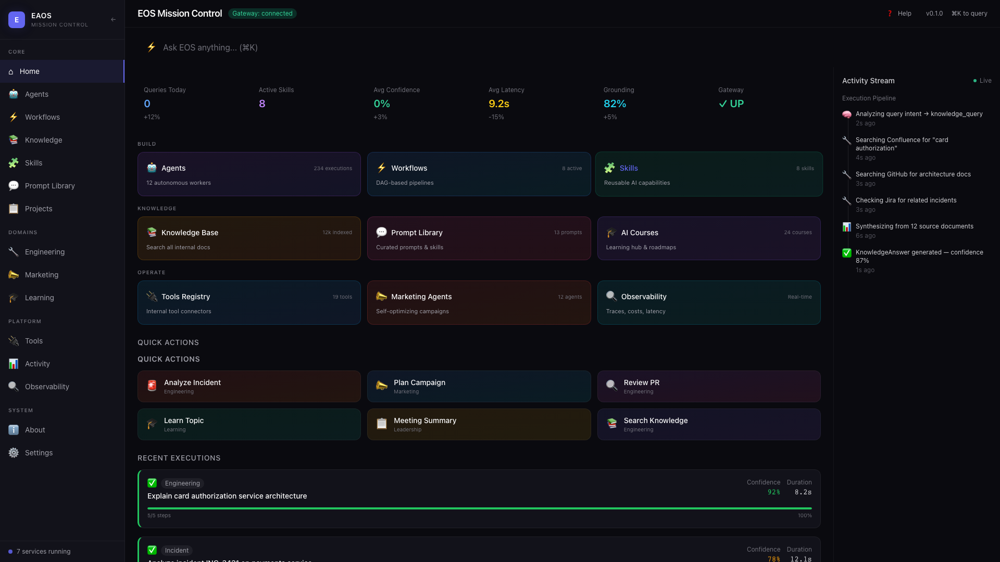
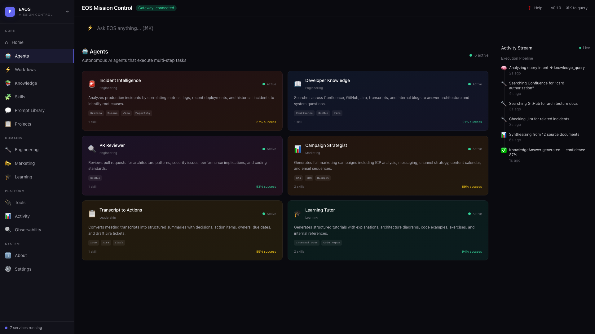
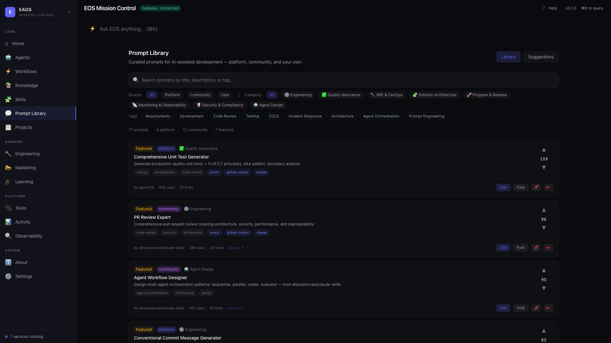
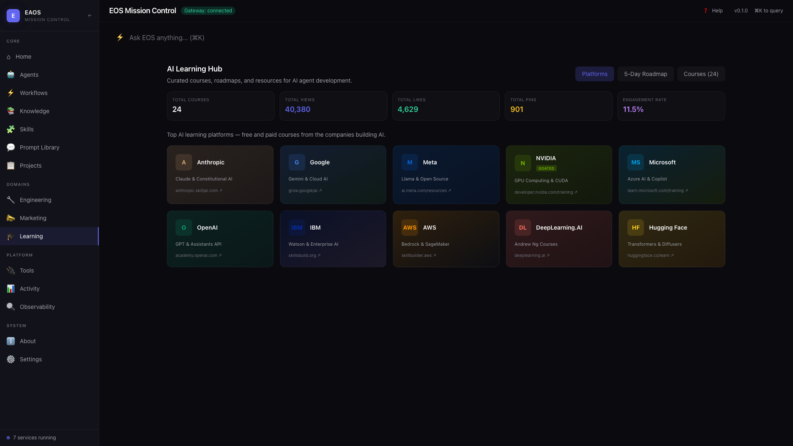
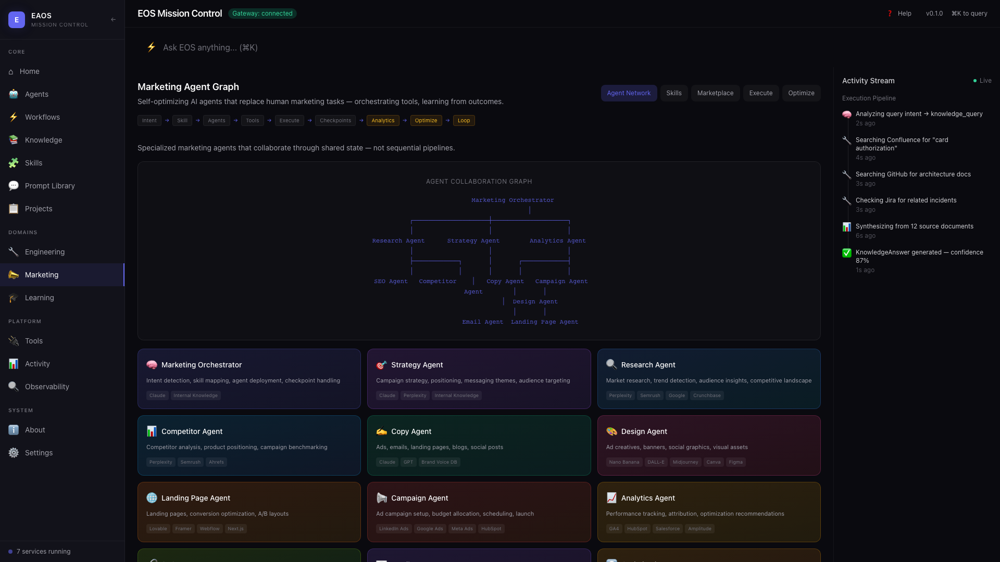
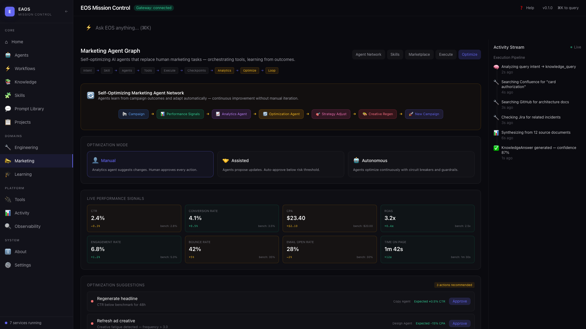
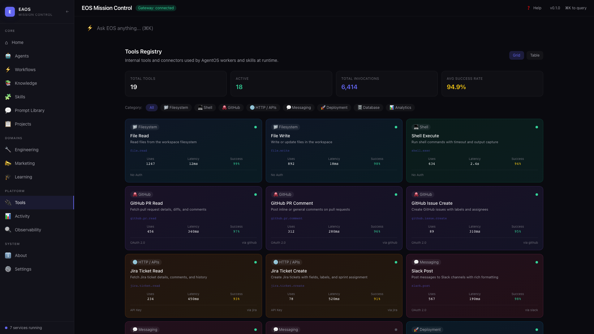

# Enterprise Agent OS

> **AI-Powered Enterprise Operating System** — Orchestration, governance, memory, and observability for autonomous AI agent clusters.

Enterprise Agent OS (EAOS) is a full-stack platform that coordinates AI agents and external tools to automate complex enterprise workflows. It doesn't replace tools — it **orchestrates them through intelligent agents**.

---

## Screenshots

### Home Dashboard
The mission control view with persona-based navigation, live stats, quick actions, and recent execution cards with confidence scores and grounding validation.



### Agents Panel
12 autonomous AI agents with multi-step execution pipelines, real-time status tracking, and configurable worker definitions.



### Prompt Library
Browse, search, and fork curated AI prompts. Filter by source (platform, community, user), category, or tags. Upvote, flag, pin, or fork prompts. Submit and vote on prompt recommendations.



### AI Learning Hub
10 major AI platform links, a 5-day agent development roadmap, and 24 curated courses with engagement tracking (likes, pins, views, shares). Measures organizational AI adoption interest.



### Marketing Agent Network
Self-Optimizing Marketing Agent Network (SOMAN) with 12 collaborative agents, skill registry, tool marketplace, and execution timeline with human-in-the-loop checkpoints.



### SOMAN Optimization Loop
Continuous campaign optimization: Performance Signals → Analytics → Optimization Agent → Strategy Adjust → Creative Regen → New Campaign. Three optimization modes: Manual, Assisted, Autonomous.



### Tools Registry
Internal tool connectors with auth types, usage statistics, latency metrics, and success rates. Grid and table views with category filtering.



---

## Architecture

```
┌─────────────────────────────────────────────────────────┐
│                    Frontend (Next.js 14)                 │
│  Sidebar │ Command Bar │ Main Content │ Activity Stream  │
├──────────┴─────────────┴──────────────┴─────────────────┤
│                    Gateway API (Node.js)                 │
│  /api/query │ /api/skills │ /api/prompts │ /api/courses  │
├─────────────────────────────────────────────────────────┤
│              Agent Graph Runtime (LangGraph)             │
│  Orchestrator → Agents → Tools → Checkpoints → Storage  │
├─────────────────────────────────────────────────────────┤
│  Tool Capability Graph │ Memory Pipeline │ Policy Engine │
├─────────────────────────────────────────────────────────┤
│  Connectors: Jira │ GitHub │ Slack │ Confluence │ etc.  │
└─────────────────────────────────────────────────────────┘
```

### Core Principles

```
User Intent → Skill Detection → Agent Deployment → Tool Selection
     → Workflow Orchestration → Execution → Human Checkpoints → Asset Storage
```

---

## Features

### Core Platform
- **Agents** — 12+ autonomous workers with multi-step execution pipelines
- **Workflows** — DAG-based pipelines chaining agents and tools
- **Knowledge Explorer** — Search across Confluence, GitHub, Jira with source attribution
- **Skills** — Reusable AI capabilities with success rates and quality tiers
- **Command Bar** — Natural language queries with intent classification (Cmd+K)

### Prompt Library
- **13+ curated prompts** across engineering, QA, SRE, architecture categories
- **Community skills** curated from 6 open-source repositories
- **Fork, pin, upvote, flag** — full engagement lifecycle
- **Recommendations** — Users submit and vote on new prompt ideas
- **Target tools** — Cursor, GitHub Copilot, Claude, ChatGPT, Office Copilot

### AI Learning Hub
- **10 Platform Providers** — Anthropic, Google, Meta, NVIDIA, Microsoft, OpenAI, IBM, AWS, DeepLearning.AI, Hugging Face
- **5-Day Roadmap** — Visual milestone journey covering AI Agents, MCP, Memory, Quality, Production
- **24 Courses** — Categorized, filterable, with engagement tracking
- **Organization Stats** — Aggregate views, likes, pins to measure AI adoption

### Marketing Agent Graph (SOMAN)
- **12 Specialized Agents** — Orchestrator, Strategy, Research, Competitor, Copy, Design, Landing Page, Campaign, Analytics, Optimization, SEO, Email
- **Self-Optimizing Loop** — Agents learn from campaign outcomes and adapt automatically
- **Tool Marketplace** — 16 connectors (Canva, DALL-E, LinkedIn Ads, HubSpot, GA4, etc.)
- **10 Marketing Skills** — Campaign Builder, Content Creation, Creative Design, and more
- **Human-in-the-Loop** — Approval checkpoints before critical actions
- **3 Optimization Modes** — Manual, Assisted, Autonomous

### Tool Capability Graph
- **Dynamic tool selection** — Maps tasks → capabilities → tools
- **20 capabilities** across content, visual, layout, campaign, analytics, research, storage
- **22 tool nodes** with priority, cost tier, and latency rankings
- **Execution planning** — Query graph for optimal tool chains

### Observability
- **Execution traces** — Every LLM call, tool invocation, memory retrieval
- **Token usage and cost tracking** — Per-query cost analysis
- **Confidence and grounding scores** — Quality metrics on every response

### Guided Tour
- **29-step interactive tour** covering all sections
- **Onboarding modal** for first-time users
- **Keyboard navigation** (Arrow keys, Escape, Enter)
- **Help menu** with tour restart

---

## Tech Stack

| Layer | Technology |
|-------|-----------|
| Frontend | Next.js 14, React 18, TypeScript, Tailwind CSS, Zustand, Framer Motion |
| Gateway API | Node.js HTTP server, TypeScript |
| State Management | Zustand |
| Data Fetching | TanStack React Query |
| Monorepo | pnpm workspaces + Turborepo |
| Schemas | JSON Schema (skills, tools, prompts, workflows, workers, policies) |
| Database | PostgreSQL (Prisma for Prompt Library) |
| Agent Runtimes | LangGraph (default), AutoGen, CrewAI, Custom |
| Connectors | Jira, GitHub, Slack, Confluence |

---

## Project Structure

```
Enterprise-Agent-OS/
├── apps/
│   └── web/                    # Next.js 14 frontend
│       └── src/
│           ├── app/            # App Router pages
│           ├── components/     # UI components
│           │   ├── MarketingHub.tsx
│           │   ├── PromptLibrary.tsx
│           │   ├── AICoursesHub.tsx
│           │   ├── ToolsRegistry.tsx
│           │   ├── Workspace.tsx
│           │   ├── Sidebar.tsx
│           │   ├── CommandBar.tsx
│           │   └── tour/       # Guided tour system
│           ├── store/          # Zustand stores
│           └── lib/            # API client, tour data, utils
├── services/
│   ├── gateway/                # API gateway (Node.js)
│   ├── orchestrator/           # Mother orchestrator
│   ├── cognitive-engine/       # LLM reasoning
│   ├── reliability-engine/     # Grounding & validation
│   ├── skills-runtime/         # Skill execution
│   ├── learning-engine/        # AI learning engine
│   ├── memory/                 # Memory pipeline
│   └── workspace-api/          # Workspace management
├── packages/
│   ├── schemas/                # JSON schemas (skill, tool, prompt, workflow)
│   ├── kernel/                 # Core kernel
│   ├── knowledge/              # Knowledge base
│   ├── policy/                 # Policy engine
│   ├── events/                 # Event system
│   ├── db/                     # Database & migrations
│   ├── llm/                    # LLM abstractions
│   └── ...                     # 20+ packages
├── connectors/
│   ├── jira/                   # Jira connector
│   ├── github/                 # GitHub connector
│   ├── slack/                  # Slack connector
│   └── teams/                  # Teams connector
├── workers/
│   ├── developer-knowledge/    # Engineering knowledge worker
│   ├── incident-intelligence/  # Incident analysis worker
│   └── transcript-actions/     # Transcript processing
├── agents/
│   └── marketing/              # Marketing Agent Graph (SOMAN)
│       ├── orchestrator/       # Marketing Orchestrator
│       ├── agents/             # 11 specialist agents
│       ├── graph_runtime/      # Agent collaboration graph
│       ├── skills/             # 10 marketing skills
│       ├── tools/              # 14 tool connectors
│       └── memory/             # Campaign memory schema
├── Prompt Library/             # Prompt Library (Prisma-based)
└── docs/
    └── screenshots/            # App screenshots
```

---

## Getting Started

### Prerequisites

- Node.js >= 20.0.0
- pnpm >= 9.0.0

### Installation

```bash
git clone https://github.com/Phani3108/Enterprise-Agent-OS.git
cd Enterprise-Agent-OS
pnpm install
```

### Running the App

Start both the Gateway API and the Frontend:

```bash
# Terminal 1 — Gateway API (port 3000)
cd services/gateway
npx tsx src/server.ts

# Terminal 2 — Frontend (port 3010)
cd apps/web
pnpm dev
```

Open [http://localhost:3010](http://localhost:3010) in your browser.

### First Time?

The app will show an **onboarding modal** on your first visit. After that, use the **Help menu** (top-right) to restart the guided tour anytime.

---

## Guided Tour

The app includes a 29-step interactive guided tour that covers:

| Step | Section | What You Learn |
|------|---------|---------------|
| 1-2 | Sidebar | Navigation, Mission Control overview |
| 3-6 | Core | Agents, Workflows, Knowledge, Skills |
| 7 | Projects | Organization and tracking |
| 8-9 | Domains | Engineering, Marketing |
| 10 | Learning | AI courses and roadmaps |
| 11-13 | System | Activity, Observability, About |
| 14-16 | Workspace | Command Bar, Stats, Quick Actions |
| 17-18 | Executions | Cards, pipeline traces |
| 19-20 | Activity | Stream, execution pipeline |
| 21 | Gateway | Connection status |
| 22-25 | New Sections | Prompts, Tools, Courses, Marketing |
| 26-29 | Advanced | Settings, Help, Evidence, Completion |

**Keyboard shortcuts**: Arrow keys to navigate, Escape to skip, Enter to advance.

---

## API Endpoints

| Method | Endpoint | Description |
|--------|----------|-------------|
| POST | `/api/query` | Natural language query |
| GET | `/api/skills` | Skill catalog |
| GET | `/api/prompts` | Prompt library (with filters) |
| POST | `/api/prompts/:id/vote` | Upvote/downvote prompt |
| POST | `/api/prompts/:id/fork` | Fork a prompt |
| GET | `/api/recommendations` | User-submitted suggestions |
| GET | `/api/tools` | Tools registry |
| GET | `/api/courses/stats` | Course engagement stats |
| GET | `/api/capability-graph` | Tool capability graph |
| POST | `/api/capability-graph/plan` | Generate execution plan |
| GET | `/api/health` | Gateway health check |

---

## Marketing Agent Graph (SOMAN)

The Self-Optimizing Marketing Agent Network is a collaborative AI agent system where agents reason together through shared state:

```
                     Marketing Orchestrator
                              │
         ┌────────────────────┼────────────────────┐
         │                    │                    │
   Research Agent       Strategy Agent       Analytics Agent
         │                    │                    │
         ├──────────┐         │         ┌──────────┤
         │          │         │         │          │
    SEO Agent  Competitor     │    Copy Agent  Campaign Agent
                 Agent        │         │
                              │    Design Agent
                              │         │
                         Email Agent  Landing Page Agent
                                        │
                              Optimization Agent ◀── Feedback Loop
```

**Optimization Loop**: Campaign → Performance Signals → Analytics → Optimization → Strategy Adjust → Creative Regen → New Campaign

---

## Schemas

All definitions are validated against JSON schemas in `packages/schemas/`:

- `skill.schema.json` — Skill definitions
- `tool.schema.json` — Tool connectors
- `prompt.schema.json` — Prompt library entries
- `workflow.schema.json` — Workflow definitions
- `worker.schema.json` — Worker configurations
- `event.schema.json` — Event types
- `policy.schema.json` — Policy rules
- `capability-graph.schema.json` — Tool capability graph

---

## License

MIT

---

Built with Next.js, TypeScript, Tailwind CSS, and a lot of AI agents.
