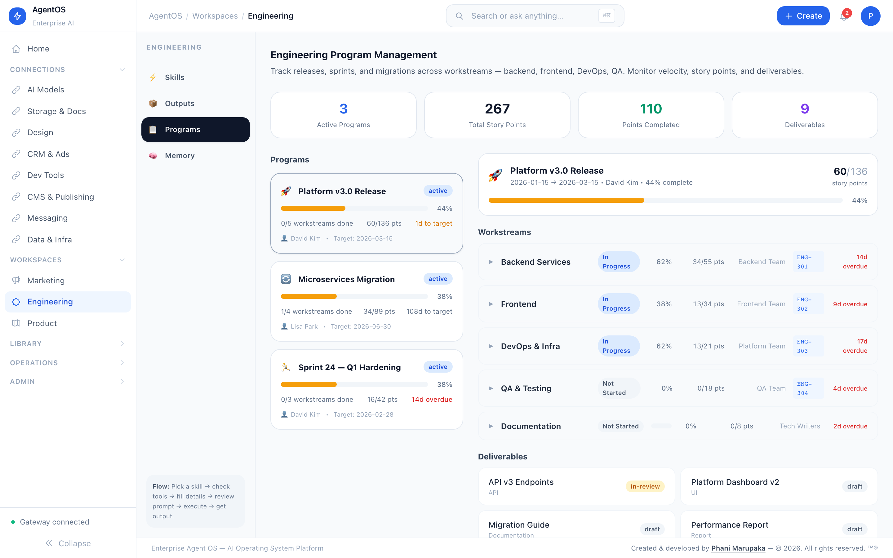
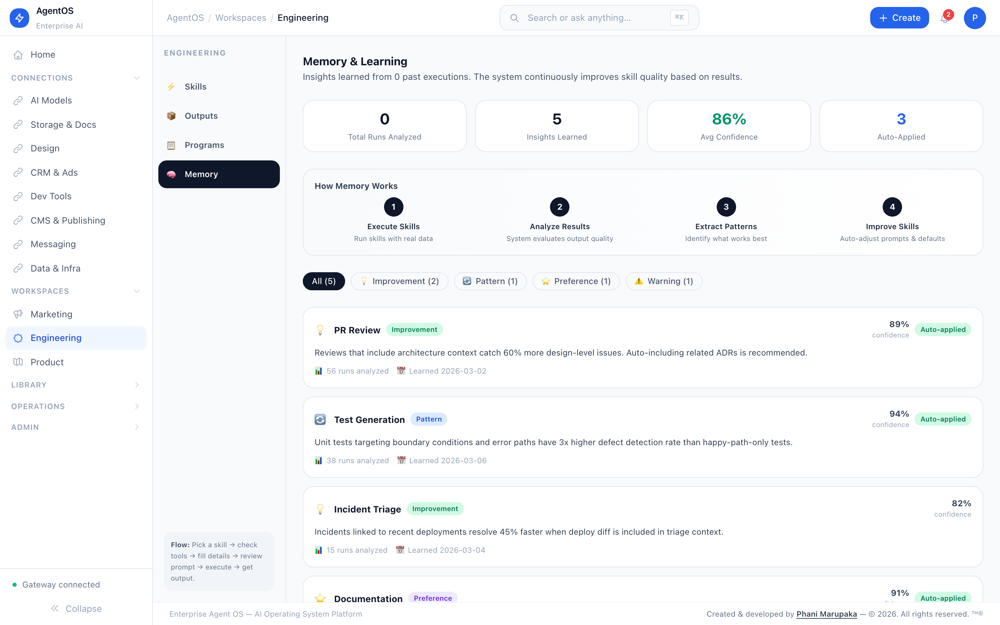
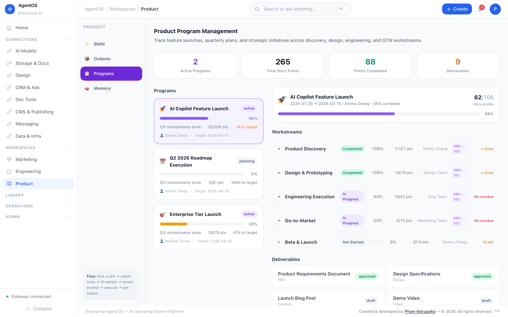
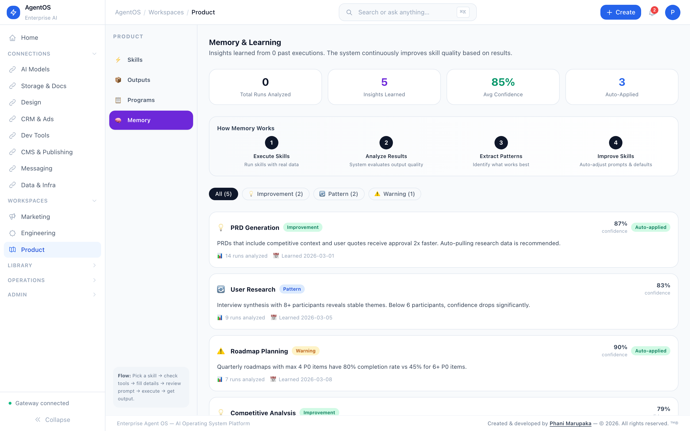
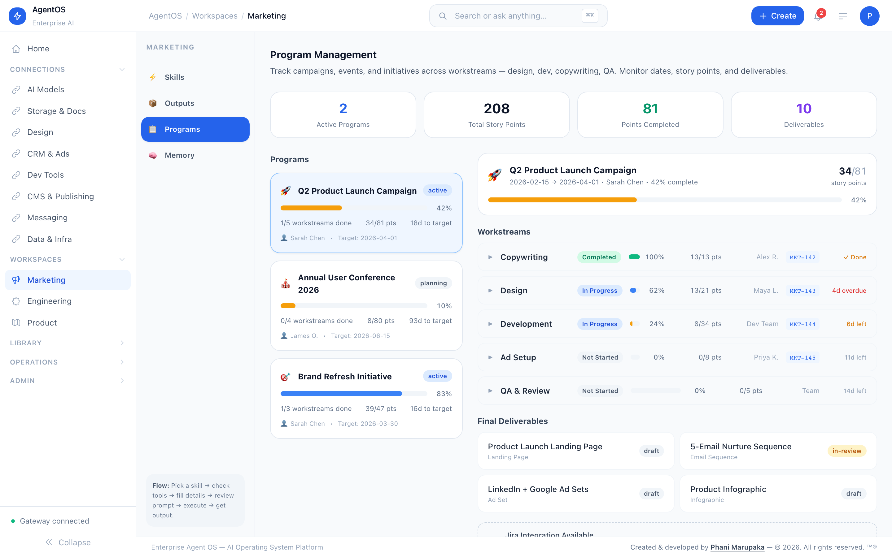
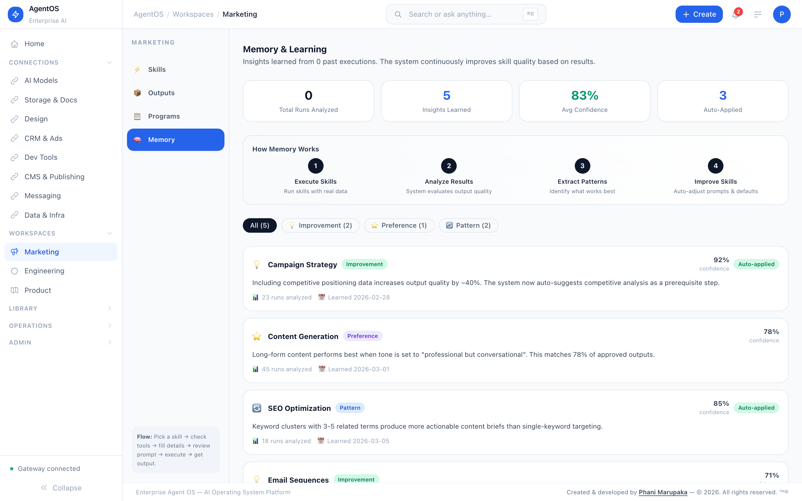
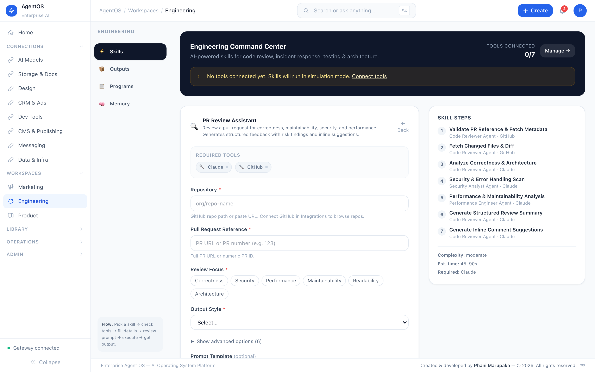
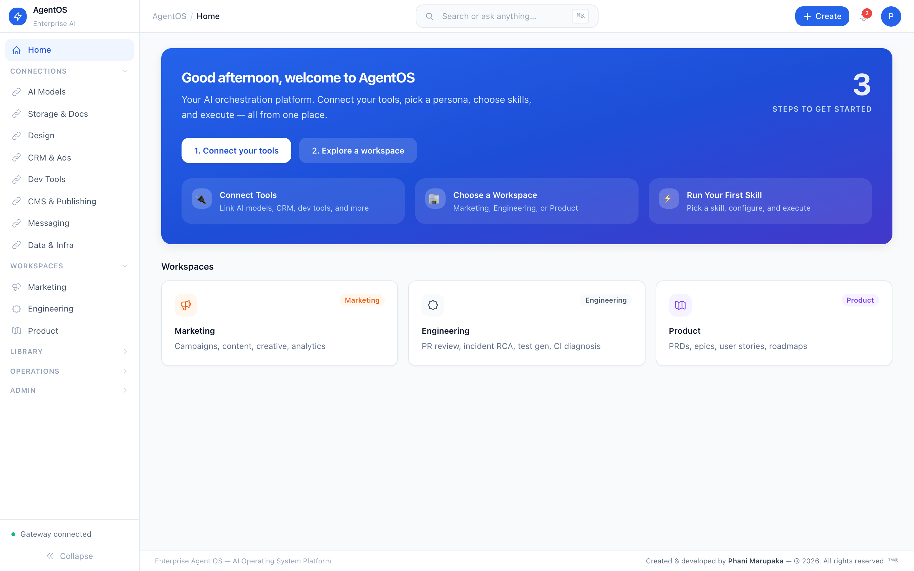
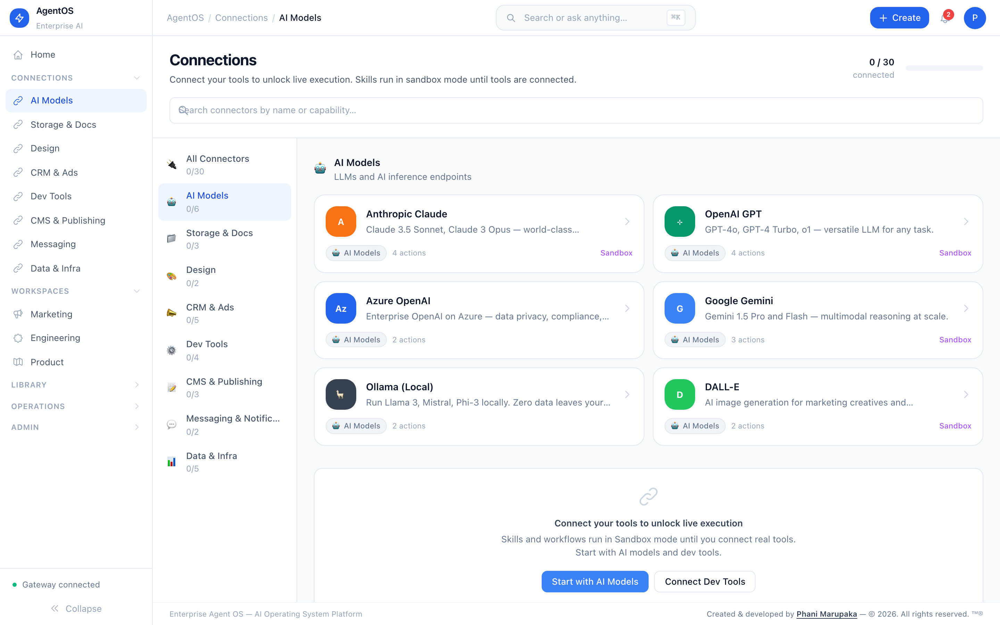

# Enterprise Agent OS

> **AI-Powered Enterprise Operating System** — Orchestration, governance, memory, and observability for autonomous AI agent clusters.

Enterprise Agent OS (EAOS) is a full-stack platform that coordinates AI agents and external tools to automate complex enterprise workflows. It doesn't replace tools — it **orchestrates them through intelligent agents**.

---

## Demo

https://github.com/user-attachments/assets/agentos-simulation-demo.mp4

> Full simulation demo — Engineering skill execution from start to finish. [Watch on GitHub →](demos/agentos-simulation-demo.mp4)

---

## Screenshots

### Command Center (Home)
Mission control dashboard — live agent stats, recent executions, agent activity feed, platform health, and quick-action shortcuts. The OS home screen.


### Personas
Browse AI personas (Marketing, Engineering, Product) and their associated skills, tools, and agents. Each persona scopes the platform to its domain.


---

## Persona Hubs — Carousel

Each persona hub provides a unified workspace with **Skills → Outputs → Programs → Memory** tabs, a skill form with simulation mode, and a full execution pipeline.

---

### Engineering Hub

<table>
<tr>
<td width="50%">

**1. Skills Dashboard**
Browse 10 engineering skills across Code Review, Testing, Incident Response, and Documentation clusters.


</td>
<td width="50%">

**2. Execution Outputs**
Review generated outputs — PRDs, reviews, test suites, docs — with export actions and quality metrics.


</td>
</tr>
<tr>
<td width="50%">

**3. Program Management**
Track engineering programs across sprints — backlog items, milestones, team velocity, and deliverables.



</td>
<td width="50%">

**4. Memory Graph**
Agent memory — past executions, learned patterns, context retention, and knowledge persistence.



</td>
</tr>
<tr>
<td width="50%">

**5. Skill Configuration Form**
Smart adaptive forms — file upload, severity selectors, conditional fields, and required tool indicators.


</td>
<td width="50%">

**6. Simulation Mode**
Toggle simulation mode to run skills without real tool connections — safe dry-run for testing workflows.


</td>
</tr>
</table>

---

### Product Hub

<table>
<tr>
<td width="50%">

**1. Skills Dashboard**
10 product skills — PRD Generator, Jira Epic Writer, User Story Builder, Roadmap Planner, and more.


</td>
<td width="50%">

**2. Execution Outputs**
Generated PRDs, user stories, roadmaps, and release notes — with Jira and Confluence push integration.


</td>
</tr>
<tr>
<td width="50%">

**3. Program Management**
Product programs with milestone tracking, stakeholder updates, and cross-functional delivery timelines.



</td>
<td width="50%">

**4. Memory Graph**
Product context memory — past decisions, research insights, and customer feedback patterns.



</td>
</tr>
<tr>
<td width="50%">

**5. Skill Configuration Form**
Tags input for success metrics, constraints, and stakeholders. Toggle Jira push and Confluence drafts.


</td>
<td width="50%">

**6. Simulation Mode**
Dry-run product skills — generate mock PRDs, user stories, and roadmaps without API calls.


</td>
</tr>
</table>

---

### Marketing Hub

<table>
<tr>
<td width="50%">

**1. Skills Dashboard**
30 marketing workflows across Campaign, Content, Creative, Event, Research, Analytics, and Sales clusters.


</td>
<td width="50%">

**2. Execution Outputs**
Campaign assets, content drafts, analytics reports, and creative briefs — with export and sharing.


</td>
</tr>
<tr>
<td width="50%">

**3. Program Management**
Marketing programs with campaign timelines, budget tracking, ROI metrics, and team assignments.



</td>
<td width="50%">

**4. Memory Graph**
Campaign memory — audience insights, brand voice patterns, performance history, and learned optimizations.



</td>
</tr>
<tr>
<td width="50%">

**5. Skill Configuration Form**
Campaign builder with audience targeting, channel selection, budget allocation, and content parameters.


</td>
<td width="50%">

**6. Simulation Mode**
Simulate marketing campaigns — generate mock assets, analytics, and performance projections safely.


</td>
</tr>
</table>

---

## Simulation Platform

The simulation platform enables **risk-free testing** of any skill or workflow across all personas. Enable simulation mode to run the full execution pipeline — agent orchestration, tool calls, and output generation — without connecting real tools or making live API calls.

<table>
<tr>
<td width="33%">

**Engineering Simulation**




</td>
<td width="33%">

**Product Simulation**


</td>
<td width="33%">

**Marketing Simulation**


</td>
</tr>
</table>

**Simulation features:**
- **Dry-run mode** — No real tool calls or API requests
- **Full pipeline** — All agents, steps, and checkpoints execute as normal
- **Mock outputs** — Realistic synthetic output generation
- **Cost-free** — Zero token usage or external API costs
- **Safe testing** — No side effects on production data

---

## Core Platform Screenshots

### Skill Marketplace
Discover, search, and install skills across personas. Filter by category, status, and visibility. Browse community-contributed and platform skills with ratings and usage stats.


### Skill Builder
Create and version skills with a structured editor — define input/output schemas, required tools, content steps, and publish to the marketplace.



### Agents
View all autonomous AI agents across personas. Monitor status, model, token usage, last action, and success rates. Launch or inspect any agent directly.


### Workflow Builder
Design multi-step DAG workflows chaining agents, skills, and tools. Visual canvas with node connections and conditional branching.


### Tools Registry
Manage external tool integrations (HubSpot, Jira, GitHub, Slack, Salesforce, etc.) with auth types, capability mapping, latency, and usage statistics.


### Prompt Library
Browse, fork, pin, and upvote curated AI prompts. Filter by persona, category, or tags. Submit prompt recommendations and vote on community suggestions.


### Knowledge Explorer
Search across internal knowledge sources — Confluence, GitHub, Jira — with source attribution and semantic relevance scoring.


### Control Plane
Platform-wide monitoring with metric sparklines, agent runtime table, skill router decisions, live execution logs, system alerts, and service health indicators.


### Memory Graph
SVG force-directed graph of skill/agent/tool/workflow relationships. Pan, zoom, filter by node type, search, and click any node for connection details and usage stats.


### Agent Collaboration (ACP)
Agent-to-agent message flow visualization. SVG diagram with animated in-flight messages, edge labels by message type (delegation, handoff, approval), and JSON payload inspector.


### Governance Dashboard
Corp IT oversight — tool license tracking, cost attribution by persona, access & permission management, audit log, and compliance checklist with pass/fail/warning status.


### Observability
Live execution traces — every LLM call, tool invocation, and step. Filter by status, persona, or agent. Token usage, cost, latency, and confidence metrics per execution.


### AI Learning Hub
Curated AI courses, a 5-day agent development roadmap, and direct links to Anthropic, Google, OpenAI, and other platform providers. Track organizational AI adoption with engagement stats.


### Execution Scheduler
Schedule cron jobs and event-triggered automations. Define triggers, target skills/workflows, retry policies, and view execution history with status tracking.


### Settings
Configure profile, notification preferences, API keys, appearance, and platform defaults. Manage connected tools and session tokens.



---

## Architecture

```
┌─────────────────────────────────────────────────────────┐
│                    Frontend (Next.js 14)                 │
│  Sidebar │ Command Bar │ Main Content │ Activity Stream  │
├──────────┴─────────────┴──────────────┴─────────────────┤
│                    Gateway API (Node.js)                 │
│  /api/query │ /api/skills │ /api/prompts │ /api/courses  │
├─────────────────────────────────────────────────────────┤
│              Agent Graph Runtime (LangGraph)             │
│  Orchestrator → Agents → Tools → Checkpoints → Storage  │
├─────────────────────────────────────────────────────────┤
│  Tool Capability Graph │ Memory Pipeline │ Policy Engine │
├─────────────────────────────────────────────────────────┤
│  Connectors: Jira │ GitHub │ Slack │ Confluence │ etc.  │
└─────────────────────────────────────────────────────────┘
```

### Core Principles

```
User Intent → Skill Detection → Agent Deployment → Tool Selection
     → Workflow Orchestration → Execution → Human Checkpoints → Asset Storage
```

---

## Features

### Core Platform
- **Agents** — 12+ autonomous workers with multi-step execution pipelines
- **Workflows** — DAG-based pipelines chaining agents and tools
- **Knowledge Explorer** — Search across Confluence, GitHub, Jira with source attribution
- **Skills** — Reusable AI capabilities with success rates and quality tiers
- **Command Bar** — Natural language queries with intent classification (Cmd+K)

### Prompt Library
- **13+ curated prompts** across engineering, QA, SRE, architecture categories
- **Community skills** curated from 6 open-source repositories
- **Fork, pin, upvote, flag** — full engagement lifecycle
- **Recommendations** — Users submit and vote on new prompt ideas
- **Target tools** — Cursor, GitHub Copilot, Claude, ChatGPT, Office Copilot

### AI Learning Hub
- **10 Platform Providers** — Anthropic, Google, Meta, NVIDIA, Microsoft, OpenAI, IBM, AWS, DeepLearning.AI, Hugging Face
- **5-Day Roadmap** — Visual milestone journey covering AI Agents, MCP, Memory, Quality, Production
- **24 Courses** — Categorized, filterable, with engagement tracking
- **Organization Stats** — Aggregate views, likes, pins to measure AI adoption

### Marketing Agent Graph (SOMAN)
- **12 Specialized Agents** — Orchestrator, Strategy, Research, Competitor, Copy, Design, Landing Page, Campaign, Analytics, Optimization, SEO, Email
- **Self-Optimizing Loop** — Agents learn from campaign outcomes and adapt automatically
- **Tool Marketplace** — 16 connectors (Canva, DALL-E, LinkedIn Ads, HubSpot, GA4, etc.)
- **10 Marketing Skills** — Campaign Builder, Content Creation, Creative Design, and more
- **Human-in-the-Loop** — Approval checkpoints before critical actions
- **3 Optimization Modes** — Manual, Assisted, Autonomous

### Tool Capability Graph
- **Dynamic tool selection** — Maps tasks → capabilities → tools
- **20 capabilities** across content, visual, layout, campaign, analytics, research, storage
- **22 tool nodes** with priority, cost tier, and latency rankings
- **Execution planning** — Query graph for optimal tool chains

### Observability
- **Execution traces** — Every LLM call, tool invocation, memory retrieval
- **Token usage and cost tracking** — Per-query cost analysis
- **Confidence and grounding scores** — Quality metrics on every response

### Engineering Hub
- **10 Engineering Skills** — PR Review, PR Summary, Unit Test Generator, Code Documentation, CI Failure Diagnosis, Incident RCA Draft, Dependency Audit, Architecture Review, API Contract Validator, Performance Profiler
- **Smart Skill Forms** — adaptive field types: multiselect, tags, toggles, file upload, conditional `dependsOn` fields
- **Live / Sandbox run modes** — test without real API calls
- **Tool strip** — shows Claude (always connected), GitHub, Jira, Sentry, Datadog, PagerDuty connection states

### Product Hub
- **10 Product Skills** — PRD Generator, BRD Generator, Jira Epic Generator, User Story Writer, Acceptance Criteria Generator, Roadmap Builder, Competitor Analysis Brief, Release Notes, Stakeholder Update, Customer Feedback Synthesizer
- **Jira + Confluence integration** — push epics and drafts directly from skill forms
- **Tags fields** for success metrics, constraints, and stakeholders
- **Violet accent** distinguishes product workflows from engineering (slate) and marketing (emerald)

### Guided Tour
- **21-step interactive tour** covering all sections including Engineering and Product Hubs
- **Onboarding modal** for first-time users
- **Keyboard navigation** (Arrow keys, Escape, Enter)
- **Help menu** with tour restart

### Simulation Platform
- **Dry-run execution** — Run any skill without real tool connections or API calls
- **Full pipeline simulation** — All agents, steps, and checkpoints execute as normal
- **Mock output generation** — Realistic synthetic outputs for review and testing
- **Zero cost** — No token usage, no external API charges
- **Cross-persona** — Available for Engineering, Product, and Marketing hubs
- **Safe testing** — No side effects on production systems or data

---

## Tech Stack

| Layer | Technology |
|-------|-----------|
| Frontend | Next.js 14, React 18, TypeScript, Tailwind CSS, Zustand, Framer Motion |
| Gateway API | Node.js HTTP server, TypeScript |
| State Management | Zustand |
| Data Fetching | TanStack React Query |
| Monorepo | pnpm workspaces + Turborepo |
| Schemas | JSON Schema (skills, tools, prompts, workflows, workers, policies) |
| Database | PostgreSQL (Prisma for Prompt Library) |
| Agent Runtimes | LangGraph (default), AutoGen, CrewAI, Custom |
| Connectors | Jira, GitHub, Slack, Confluence |

---

## Project Structure

```
Enterprise-Agent-OS/
├── apps/
│   └── web/                    # Next.js 14 frontend
│       └── src/
│           ├── app/            # App Router pages
│           ├── components/     # UI components
│           │   ├── MarketingHub.tsx
│           │   ├── PromptLibrary.tsx
│           │   ├── AICoursesHub.tsx
│           │   ├── ToolsRegistry.tsx
│           │   ├── Workspace.tsx
│           │   ├── Sidebar.tsx
│           │   ├── CommandBar.tsx
│           │   └── tour/       # Guided tour system
│           ├── store/          # Zustand stores
│           └── lib/            # API client, tour data, utils
├── services/
│   ├── gateway/                # API gateway (Node.js)
│   ├── orchestrator/           # Mother orchestrator
│   ├── cognitive-engine/       # LLM reasoning
│   ├── reliability-engine/     # Grounding & validation
│   ├── skills-runtime/         # Skill execution
│   ├── learning-engine/        # AI learning engine
│   ├── memory/                 # Memory pipeline
│   └── workspace-api/          # Workspace management
├── packages/
│   ├── schemas/                # JSON schemas (skill, tool, prompt, workflow)
│   ├── kernel/                 # Core kernel
│   ├── knowledge/              # Knowledge base
│   ├── policy/                 # Policy engine
│   ├── events/                 # Event system
│   ├── db/                     # Database & migrations
│   ├── llm/                    # LLM abstractions
│   └── ...                     # 20+ packages
├── connectors/
│   ├── jira/                   # Jira connector
│   ├── github/                 # GitHub connector
│   ├── slack/                  # Slack connector
│   └── teams/                  # Teams connector
├── workers/
│   ├── developer-knowledge/    # Engineering knowledge worker
│   ├── incident-intelligence/  # Incident analysis worker
│   └── transcript-actions/     # Transcript processing
├── agents/
│   └── marketing/              # Marketing Agent Graph (SOMAN)
│       ├── orchestrator/       # Marketing Orchestrator
│       ├── agents/             # 11 specialist agents
│       ├── graph_runtime/      # Agent collaboration graph
│       ├── skills/             # 10 marketing skills
│       ├── tools/              # 14 tool connectors
│       └── memory/             # Campaign memory schema
├── Prompt Library/             # Prompt Library (Prisma-based)
└── docs/
    └── screenshots/            # App screenshots
```

---

## Getting Started

### Prerequisites

- Node.js >= 20.0.0
- pnpm >= 9.0.0

### Installation

```bash
git clone https://github.com/Phani3108/Enterprise-Agent-OS.git
cd Enterprise-Agent-OS
pnpm install
```

### Running the App

Start both the Gateway API and the Frontend:

```bash
# Terminal 1 — Gateway API (port 3000)
cd services/gateway
npx tsx src/server.ts

# Terminal 2 — Frontend (port 3010)
cd apps/web
pnpm dev
```

Open [http://localhost:3010](http://localhost:3010) in your browser.

### First Time?

The app will show an **onboarding modal** on your first visit. After that, use the **Help menu** (top-right) to restart the guided tour anytime.

---

## Guided Tour

The app includes a 29-step interactive guided tour that covers:

| Step | Section | What You Learn |
|------|---------|---------------|
| 1-2 | Welcome + Nav | Sidebar navigation, Mission Control overview |
| 3 | Intent Router | Natural language skill routing |
| 4-6 | Core Skills | Persona selector, Skills dashboard, Execution panel |
| 7 | Governance | License tracking and Corp IT dashboard |
| 8-10 | Navigation | Agents, Workflows, Skill Marketplace |
| 11-13 | Tools + Content | Tools registry, Prompt Library, Knowledge |
| 14 | Learning | AI courses and 5-day roadmap |
| 15-16 | Engineering Hub | Command Center, smart skill forms |
| 17-18 | Product Hub | PRD/Jira/Roadmap skills, tags and toggle fields |
| 19 | Tool Strip | Connected vs unconnected tool indicators |
| 20-21 | Completion | Full platform ready, tour restart |

**Keyboard shortcuts**: Arrow keys to navigate, Escape to skip, Enter to advance.

---

## API Endpoints

| Method | Endpoint | Description |
|--------|----------|-------------|
| POST | `/api/query` | Natural language query |
| GET | `/api/skills` | Skill catalog |
| GET | `/api/prompts` | Prompt library (with filters) |
| POST | `/api/prompts/:id/vote` | Upvote/downvote prompt |
| POST | `/api/prompts/:id/fork` | Fork a prompt |
| GET | `/api/recommendations` | User-submitted suggestions |
| GET | `/api/tools` | Tools registry |
| GET | `/api/courses/stats` | Course engagement stats |
| GET | `/api/capability-graph` | Tool capability graph |
| POST | `/api/capability-graph/plan` | Generate execution plan |
| GET | `/api/engineering/skills` | Engineering skill catalog |
| POST | `/api/engineering/execute` | Execute an engineering skill |
| GET | `/api/engineering/executions/:id` | Poll execution status |
| GET | `/api/product/skills` | Product skill catalog |
| POST | `/api/product/execute` | Execute a product skill |
| GET | `/api/product/executions/:id` | Poll execution status |
| POST | `/api/tools/:id/connect` | Save tool credentials |
| POST | `/api/tools/:id/test` | Test tool connection |
| GET | `/api/health` | Gateway health check |

---

## Marketing Agent Graph (SOMAN)

The Self-Optimizing Marketing Agent Network is a collaborative AI agent system where agents reason together through shared state:

```
                     Marketing Orchestrator
                              │
         ┌────────────────────┼────────────────────┐
         │                    │                    │
   Research Agent       Strategy Agent       Analytics Agent
         │                    │                    │
         ├──────────┐         │         ┌──────────┤
         │          │         │         │          │
    SEO Agent  Competitor     │    Copy Agent  Campaign Agent
                 Agent        │         │
                              │    Design Agent
                              │         │
                         Email Agent  Landing Page Agent
                                        │
                              Optimization Agent ◀── Feedback Loop
```

**Optimization Loop**: Campaign → Performance Signals → Analytics → Optimization → Strategy Adjust → Creative Regen → New Campaign

---

## Schemas

All definitions are validated against JSON schemas in `packages/schemas/`:

- `skill.schema.json` — Skill definitions
- `tool.schema.json` — Tool connectors
- `prompt.schema.json` — Prompt library entries
- `workflow.schema.json` — Workflow definitions
- `worker.schema.json` — Worker configurations
- `event.schema.json` — Event types
- `policy.schema.json` — Policy rules
- `capability-graph.schema.json` — Tool capability graph

---

## License

MIT

---

## Author

**Created & developed by [Phani Marupaka](https://linkedin.com/in/phani-marupaka)**

&copy; 2026 Phani Marupaka. All rights reserved.

Unauthorized reproduction, distribution, or modification of this software, in whole or in part, is strictly prohibited under applicable trademark and copyright laws including but not limited to the Digital Millennium Copyright Act (DMCA), the Lanham Act (15 U.S.C. &sect; 1051 et seq.), and equivalent international intellectual property statutes. This software contains embedded provenance markers and attribution watermarks that are protected under 17 U.S.C. &sect; 1202 (integrity of copyright management information). Removal or alteration of such markers constitutes a violation of federal law.

---

Built with Next.js, TypeScript, Tailwind CSS, and a lot of AI agents.
