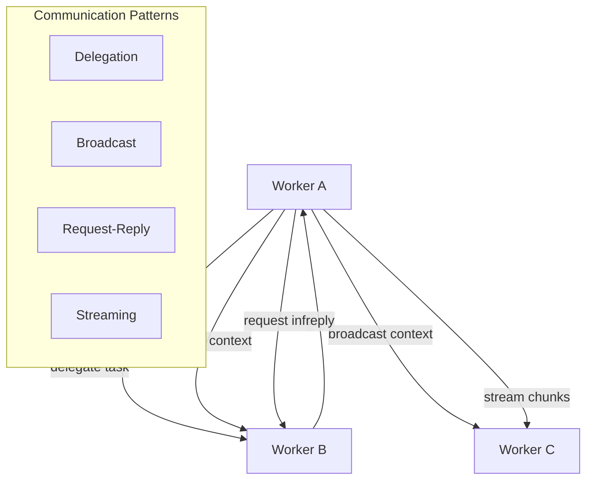
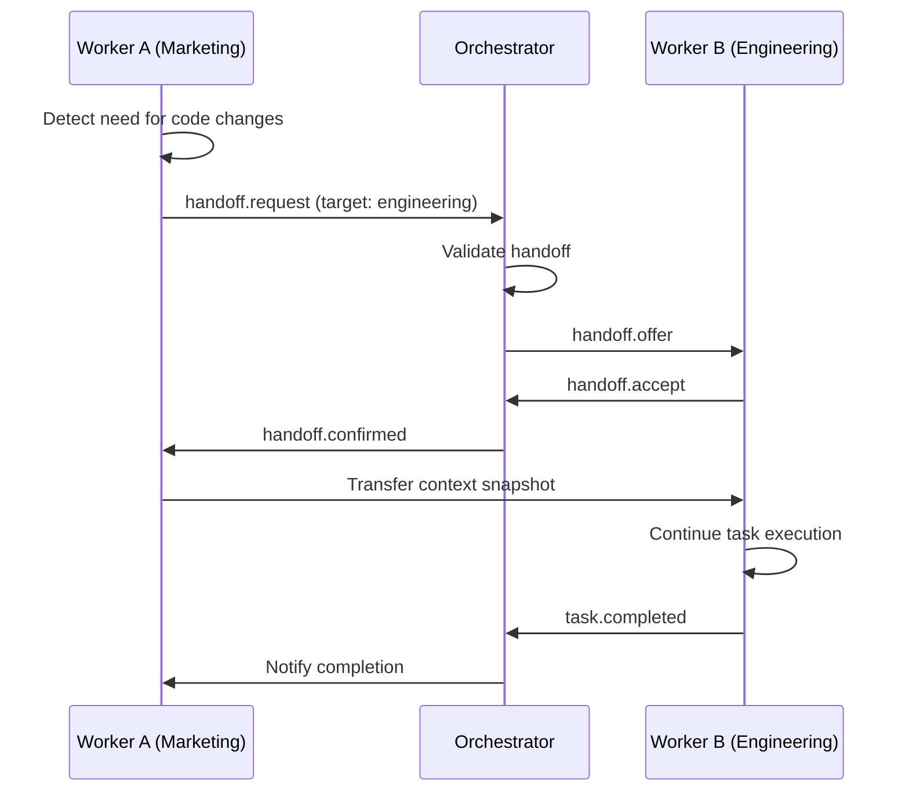

# Agent-to-Agent Protocol

The agent protocol defines how workers **communicate, delegate, and coordinate** with each other during workflow execution.

---

## Communication Patterns



### 1. Delegation

A worker spawns a sub-task for another worker and awaits the result.

```typescript
// Worker A delegates to Worker B
const result = await ctx.delegate({
  targetWorker: 'code-reviewer',
  taskType: 'review-pr',
  input: { diff: prDiff, guidelines: reviewRules },
  timeout: 60000,
  priority: 'high'
});
```

**Delegation Model:**
```typescript
interface DelegationRequest {
  id: string;
  sourceWorker: string;
  targetWorker: string;
  taskType: string;
  input: unknown;
  priority: 'low' | 'normal' | 'high' | 'critical';
  timeout: number;
  parentTaskId: string;          // trace lineage
  parentExecutionId: string;
  contextSnapshot: Record<string, unknown>;  // shared state
}

interface DelegationResponse {
  requestId: string;
  status: 'completed' | 'failed' | 'timeout';
  output?: unknown;
  error?: string;
  durationMs: number;
  delegateWorkerId: string;
}
```

### 2. Broadcast

A worker publishes context to all workers in the same execution.

```typescript
// Broadcast to all workers in this workflow execution
await ctx.broadcast({
  type: 'context.update',
  key: 'api-schema-v2',
  data: { endpoints: [...], models: [...] }
});
```

### 3. Request-Reply

Synchronous question-answer between workers.

```typescript
// Worker A asks Worker B a question
const answer = await ctx.ask('strategy-analyst', {
  question: 'What is the priority order for Q2 initiatives?',
  context: { department: 'engineering' }
});
```

### 4. Streaming

Long-running results streamed chunk-by-chunk.

```typescript
// Stream results from a long-running worker
const stream = await ctx.stream('report-generator', {
  type: 'quarterly-report',
  format: 'markdown'
});

for await (const chunk of stream) {
  // Process streaming chunks
  console.log(chunk.content);
}
```

---

## Message Format

All inter-agent messages use a standard format:

```typescript
interface AgentMessage {
  id: string;                    // message ID
  type: MessageType;
  source: string;                // source worker ID
  target: string | '*';          // target worker or broadcast
  executionId: string;           // workflow execution scope
  payload: unknown;
  replyTo?: string;              // for request-reply pattern
  correlationId?: string;        // links request to reply
  timestamp: Date;
  ttl?: number;                  // message expiry in ms
  priority: 'low' | 'normal' | 'high' | 'critical';
}

type MessageType =
  | 'delegation.request'
  | 'delegation.response'
  | 'context.update'
  | 'context.query'
  | 'ask.request'
  | 'ask.response'
  | 'stream.start'
  | 'stream.chunk'
  | 'stream.end'
  | 'handoff.request'
  | 'handoff.accept';
```

---

## Handoff Protocol

When a worker determines it's not the best agent for a (sub-)task, it can **hand off** to a more suitable worker.



**Handoff Payload:**
```typescript
interface HandoffRequest {
  sourceWorker: string;
  targetCluster: string;
  reason: string;                // why the handoff is needed
  taskContext: {
    taskId: string;
    originalInput: unknown;
    progressSoFar: unknown;
    remainingWork: string;
  };
  contextSnapshot: Record<string, unknown>;
}
```

---

## Security

| Concern | Mechanism |
|---------|-----------|
| Authentication | Worker identity verified via signed tokens |
| Authorization | Policy engine checks delegation permissions |
| Isolation | Workers in different tenants cannot communicate |
| Encryption | mTLS for all inter-agent messages |
| Rate limiting | Per-worker message rate limits |
| Audit | All messages logged to audit trail |

---

## Configuration

```yaml
agent_protocol:
  transport: event_bus           # uses the event bus for messaging
  delegation:
    max_depth: 5                 # max delegation chain depth
    default_timeout_ms: 60000
    allow_cross_cluster: true
  broadcast:
    max_payload_bytes: 65536
    ttl_ms: 300000
  request_reply:
    default_timeout_ms: 30000
  streaming:
    max_chunk_size_bytes: 8192
    buffer_size: 100
  handoff:
    require_orchestrator_approval: true
    max_handoffs_per_task: 3
```
