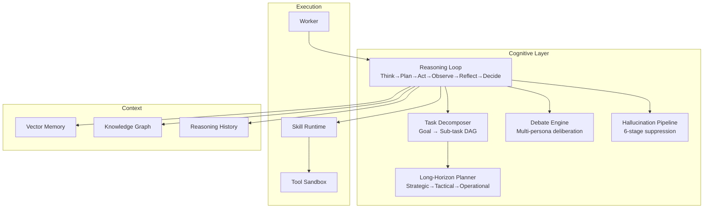

# Agent Cognitive Architecture

## Overview

The cognitive architecture transforms agents from simple prompt→response systems into **reasoning, self-reflecting, deliberating entities** with long-horizon planning and hallucination suppression.



## Reasoning Loop

Iterative cycle with self-correction:

```
THINK    — reason about current state and knowledge gaps
    ↓
PLAN     — determine next action (tool call or reasoning)
    ↓
ACT      — execute tool or generate content
    ↓
OBSERVE  — process action results
    ↓
REFLECT  — metacognitive evaluation (every N steps)
    ↓
DECIDE   — check if answer meets confidence threshold
    ↓
[loop or return]
```

**Backtracking**: If reflection reveals a reasoning error, the loop backtracks and tries an alternative approach.

## Multi-Agent Debate

For complex decisions, multiple LLM "personas" debate:

| Round | Debater A | Debater B | Debater C |
|-------|-----------|-----------|-----------|
| 1 | Initial position | Initial position | Initial position |
| 2 | Counter-arguments | Revised position | Counter-arguments |
| 3 | Final position | Final position | Final position |
| Judge | — | — | Synthesized answer |

**Consensus Detection**: Early exit if all debaters converge (≥90% agreement + ≥70% confidence).

## Hallucination Suppression Pipeline

```
LLM Output
    ↓
1. CLAIM EXTRACTION   — isolate factual claims (statistics, attributions, technical)
    ↓
2. SOURCE GROUNDING   — verify each claim against provided context
    ↓
3. SELF-CONSISTENCY   — check N samples for agreement
    ↓
4. CITATION CHECK     — verify cited sources exist in context
    ↓
5. CONFIDENCE SCORE   — compute grounding score
    ↓
6. AUTO-FIX           — rewrite ungrounded claims using verified context
```

**Claim Categories**:
- `statistic` — numbers, percentages, metrics (STRICT)
- `attribution` — quotes, statements attributed to people/orgs (STRICT)
- `technical` — technical claims about systems (STRICT)
- `process` — process descriptions (MODERATE)
- `temporal` — time-based claims (MODERATE)
- `opinion` — subjective assessments (LENIENT)

## Long-Horizon Planning

Hierarchical plan decomposition adapts model-predictive control for LLM agents:

```
STRATEGIC (weeks-months)
    ├── Milestone 1
    │   ├── TACTICAL (days-weeks)
    │   │   ├── Work Stream A
    │   │   │   ├── OPERATIONAL (min-hours)
    │   │   │   │   ├── Step 1 → execute
    │   │   │   │   ├── Step 2 → execute
    │   │   │   │   └── Checkpoint → evaluate
    │   │   │   └── ...
    │   │   └── Work Stream B
    │   └── ...
    └── Milestone 2
```

**Revision Triggers**:
- New observation invalidates assumptions
- Step failure
- Checkpoint condition met
- External information
- Manual override

## Integration Points

| Cognitive Module | Integrates With |
|-----------------|----------------|
| Reasoning Loop | Workers, Skills, Tools |
| Task Decomposer | Scheduler, Graph Engine |
| Debate Engine | Policy Engine (governance decisions) |
| Hallucination Pipeline | Evaluation Engine, Skill Executor |
| Long-Horizon Planner | Orchestrator, Workflow Runner |
