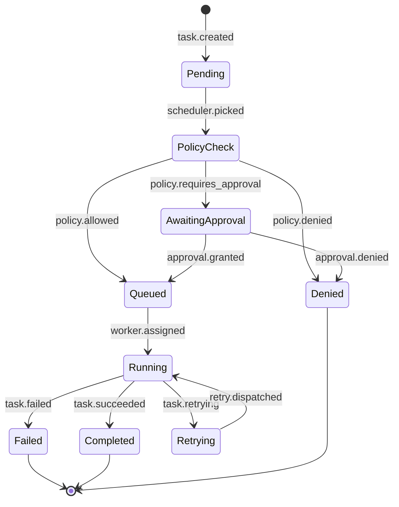
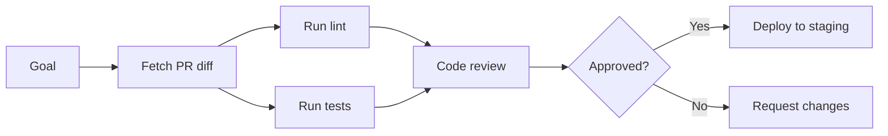

# Control Plane

The control plane is the **brain** of AgentOS. It receives high-level goals, decomposes them into executable task DAGs, schedules work across worker clusters, and manages the full lifecycle.

---

## Components

### Orchestrator

The top-level coordinator. Receives goals from the API gateway and manages their end-to-end execution.

**Responsibilities:**
- Goal intake and validation
- Workflow instantiation
- Cross-worker coordination
- Result aggregation and delivery
- Error escalation

**Key Interfaces:**
```typescript
interface Orchestrator {
  submitGoal(goal: Goal): Promise<GoalExecution>;
  getStatus(executionId: string): Promise<ExecutionStatus>;
  cancel(executionId: string): Promise<void>;
  replay(executionId: string): Promise<GoalExecution>;
}
```

### Planner

LLM-powered task decomposition engine. Takes a high-level goal and produces a DAG of concrete tasks.

**Planning Strategy:**
1. **Analyze** the goal — identify domain, complexity, required capabilities
2. **Decompose** into atomic tasks — each assignable to a single worker
3. **Resolve dependencies** — determine execution order and parallelism
4. **Assign workers** — match tasks to worker capabilities
5. **Validate** — check policies, resource availability, and feasibility

**Key Interfaces:**
```typescript
interface Planner {
  plan(goal: Goal, context: PlanningContext): Promise<TaskDAG>;
  replan(dag: TaskDAG, failure: TaskFailure): Promise<TaskDAG>;
  estimate(dag: TaskDAG): Promise<ResourceEstimate>;
}
```

**Planning Models:**
- Default: GPT-4o for complex multi-domain goals
- Fast: GPT-4o-mini for simple single-domain tasks
- Custom: pluggable model via worker manifest

### Scheduler

Priority-based task scheduler with concurrency management.

**Scheduling Algorithm:**
1. Topological sort of task DAG
2. Priority assignment (urgency × impact × resource cost)
3. Concurrency limit enforcement per cluster
4. Worker affinity matching
5. Dispatch to execution layer

**Key Interfaces:**
```typescript
interface Scheduler {
  schedule(dag: TaskDAG): Promise<Schedule>;
  dispatch(task: ScheduledTask): Promise<void>;
  pause(executionId: string): Promise<void>;
  resume(executionId: string): Promise<void>;
  getQueue(): Promise<QueueSnapshot>;
}
```

**Scheduling Policies:**
| Policy | Description |
|--------|-------------|
| `fifo` | First in, first out (default) |
| `priority` | Highest priority first |
| `fair-share` | Round-robin across tenants |
| `deadline` | Earliest deadline first |
| `cost-aware` | Minimize token/API cost |

---

## Task Lifecycle



---

## Goal Decomposition Example

**Input Goal:** "Review the latest PR, run tests, and deploy to staging if green"



**Generated Task DAG:**
```yaml
tasks:
  - id: fetch-diff
    worker: github-reader
    input: { pr: "{{ goal.pr_url }}" }
  - id: lint
    worker: linter
    depends_on: [fetch-diff]
  - id: test
    worker: test-runner
    depends_on: [fetch-diff]
  - id: review
    worker: code-reviewer
    depends_on: [lint, test]
    approval: required
  - id: deploy
    worker: deployer
    depends_on: [review]
    condition: "review.verdict == 'approved'"
```

---

## Configuration

```yaml
# control-plane.config.yaml
orchestrator:
  max_concurrent_goals: 50
  goal_timeout_ms: 300000
  retry_failed_goals: true

planner:
  model: gpt-4o
  max_planning_tokens: 4000
  replan_on_failure: true
  max_replans: 3

scheduler:
  algorithm: priority
  max_concurrent_tasks: 100
  dispatch_interval_ms: 100
  worker_health_check_interval_ms: 5000
```
