# Distributed Scheduler Architecture

## Scheduling Algorithms

```mermaid
graph LR
    subgraph Queue["Task Queue"]
        T1["Task P:800"]
        T2["Task P:500"]
        T3["Task P:200"]
        T4["Task P:900"]
    end

    subgraph Scorer["Priority Scorer"]
        BP["Base Priority"]
        WB["Wait Boost"]
        DP["Deadline Pressure"]
        CP["Cost Penalty"]
        RB["Retry Boost"]
    end

    subgraph Algorithms["Algorithm Selection"]
        FIFO["FIFO"]
        PRI["Priority"]
        FS["Fair-Share"]
        DL["Deadline"]
        CA["Cost-Aware"]
    end

    subgraph Dispatch["Worker Dispatch"]
        W1["Worker A"]
        W2["Worker B"]
        W3["Worker C"]
    end

    Queue --> Scorer --> Algorithms --> Dispatch
```



## Algorithm Details

| Algorithm | Best For | Priority Formula |
|-----------|---------|-----------------|
| **FIFO** | Simple workloads | Enqueue order only |
| **Priority** | Mixed criticality | `base + waitBoost + deadlinePressure + retryBoost` |
| **Fair-Share** | Multi-tenant | Priority + tenant quota enforcement |
| **Deadline** | Time-sensitive | Priority + extreme deadline pressure weighting |
| **Cost-Aware** | Budget-constrained | Priority − `costPenalty × 50` |

## Anti-Starvation

Tasks gain **+200 priority per hour** of wait time, ensuring no task starves indefinitely.

```
waitBoost = min(waitMs / 60_000, 200)
```

## Dependency Resolution

Tasks with `dependsOn` fields are held until all dependencies reach `completed` status. Failed dependency → downstream tasks skipped.

## Fair-Share Tenant Isolation

In fair-share mode, each tenant gets `maxConcurrent / activeTenants` slots. Prevents a single noisy tenant from monopolizing the queue.

## Queue Monitoring Metrics

| Metric | Alert Threshold |
|--------|----------------|
| Queue depth | > 1000 pending |
| Oldest task age | > 5 minutes |
| Running tasks | > 90% capacity |
| Failed dispatch rate | > 5% per minute |
