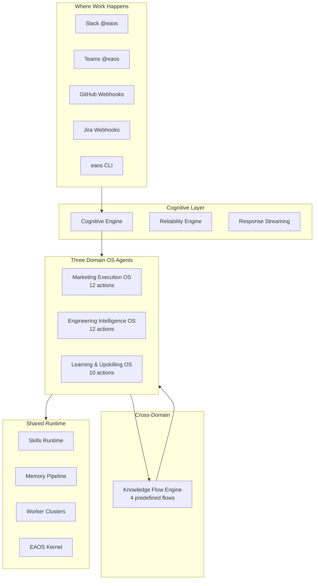

# Three-Domain OS Architecture

## The Core Insight

EAOS is not three separate AI tools. It is **one runtime** that powers three domains
with a shared kernel, memory, and knowledge flow engine.



## Domain Coverage

| Domain | Actions | Trigger Examples |
|--------|---------|-----------------|
| **Marketing** | campaign, newsletter, competitor tracking, CRM cleanup, SEO, segmentation, ad creative, email sequence, analytics | `@eaos campaign targeting credit unions` |
| **Engineering** | knowledge search, architecture explain, incident analysis, log investigation, PR review, runbook, service lookup, dependency trace, transcript→tickets, on-call assist | `@eaos how does card auth work` |
| **Learning** | tutorial, explain concept, prompt library, playbook, model comparison, architecture template, code example, best practices, assessment, learning path | `@eaos teach me RAG using our stack` |

## Cross-Domain Knowledge Flows

| Trigger | Actions | Approval |
|---------|---------|----------|
| `feature.released` | → Docs + Tutorial + Marketing messaging | Tutorial + messaging need approval |
| `incident.resolved` | → Runbook update + Troubleshooting playbook | Playbook needs approval |
| `campaign.completed` | → Executive brief + Best practices | Auto |
| `decision.made` | → Jira tickets + Marketing alignment | Both need approval |

## Why This Combination Wins

Single-domain AI tools cannot create the **knowledge flywheel**:

```
Engineering builds → EAOS documents → EAOS trains → EAOS markets
                ↑                                          ↓
                ←──── feedback improves all domains ←──────┘
```
