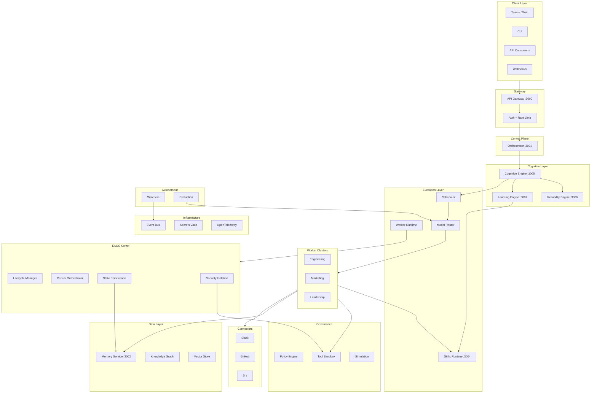

# EAOS Full Stack Architecture

## Complete System Diagram



## Service Registry

| Service | Port | Package | Layer |
|---------|------|---------|-------|
| API Gateway | 3000 | `@agentos/gateway` | Gateway |
| Orchestrator | 3001 | `@agentos/orchestrator` | Control |
| Memory Service | 3002 | `@agentos/memory` | Data |
| Skills Runtime | 3004 | `@agentos/skills-runtime` | Execution |
| Cognitive Engine | 3005 | `@agentos/cognitive-engine` | Cognitive |
| Reliability Engine | 3006 | `@agentos/reliability-engine` | Cognitive |
| Learning Engine | 3007 | `@agentos/learning-engine` | Cognitive |

## Package Dependency Map

| Package | Depends On |
|---------|-----------|
| `kernel` | runtime, events, sandbox, secrets |
| `cognition` | sdk, skills |
| `skills` | sdk, events, router, sandbox |
| `runtime` | sdk, events |
| `scheduler` | sdk, runtime |
| `router` | sdk |
| `evaluation` | — |
| `simulation` | sandbox |
| `watchers` | events |
| `knowledge` | — |
| `sandbox` | policy |
| `secrets` | — |
| `policy` | — |
| `events` | — |
| `sdk` | — |

## Request Flow (End-to-End)

```
User → Gateway → Auth → Orchestrator → Cognitive Engine
                                              ↓
                                    Decompose → Plan → Reason
                                              ↓
                                    Scheduler → Model Router
                                              ↓
                                    Worker Selected
                                              ↓
                                    Skill Loaded → Compiled
                                              ↓
                                    Memory Retrieved
                                              ↓
                                    Prompt Assembled
                                              ↓
                                    LLM Execution (sandboxed)
                                              ↓
                                    Output Validation (Reliability)
                                              ↓
                                    Hallucination Check
                                              ↓
                                    Self-Reflection
                                              ↓
                                    Final Output → User
                                              ↓
                                    Learning Engine (async)
```
