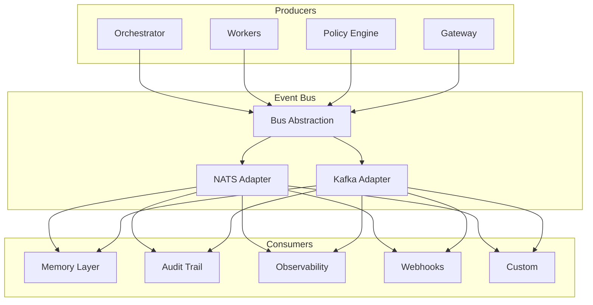

# Event Bus

The event bus is the **nervous system** of AgentOS — an asynchronous, durable message backbone that connects all services, workers, and infrastructure.

---

## Architecture



---

## Event Envelope

Every event follows a standard envelope schema:

```typescript
interface EventEnvelope<T = unknown> {
  id: string;                    // unique event ID (UUIDv7)
  type: string;                  // e.g., 'task.created', 'worker.completed'
  source: string;                // service that produced the event
  subject?: string;              // optional: entity the event is about
  time: Date;                    // when the event occurred
  specVersion: '1.0';           // envelope schema version
  dataContentType: 'application/json';
  data: T;                       // typed payload

  // AgentOS extensions
  traceId: string;               // distributed trace ID
  tenantId: string;              // multi-tenant isolation
  executionId?: string;          // workflow execution context
  idempotencyKey: string;        // for deduplication
  metadata: Record<string, string>;
}
```

---

## Event Types

### Task Events

| Event | Payload | Producer |
|-------|---------|----------|
| `task.created` | `{ taskId, workflowId, input, priority }` | Orchestrator |
| `task.scheduled` | `{ taskId, workerId, scheduledAt }` | Scheduler |
| `task.started` | `{ taskId, workerId, startedAt }` | Worker |
| `task.completed` | `{ taskId, output, durationMs, tokensUsed }` | Worker |
| `task.failed` | `{ taskId, error, retryCount }` | Worker |
| `task.retrying` | `{ taskId, attempt, nextRetryAt }` | Scheduler |

### Worker Events

| Event | Payload | Producer |
|-------|---------|----------|
| `worker.spawned` | `{ workerId, cluster, model }` | Runtime |
| `worker.ready` | `{ workerId, capabilities }` | Worker |
| `worker.busy` | `{ workerId, taskId }` | Scheduler |
| `worker.idle` | `{ workerId }` | Scheduler |
| `worker.failed` | `{ workerId, error }` | Runtime |
| `worker.terminated` | `{ workerId, reason }` | Runtime |

### Workflow Events

| Event | Payload | Producer |
|-------|---------|----------|
| `workflow.started` | `{ executionId, workflowId, trigger }` | Orchestrator |
| `workflow.step_completed` | `{ executionId, stepId, output }` | Orchestrator |
| `workflow.completed` | `{ executionId, result, durationMs }` | Orchestrator |
| `workflow.failed` | `{ executionId, failedStep, error }` | Orchestrator |

### Governance Events

| Event | Payload | Producer |
|-------|---------|----------|
| `policy.evaluated` | `{ policyId, action, decision, reason }` | Policy Engine |
| `approval.requested` | `{ approvalId, action, approvers }` | Policy Engine |
| `approval.granted` | `{ approvalId, approver }` | Approval Service |
| `approval.denied` | `{ approvalId, approver, reason }` | Approval Service |

### System Events

| Event | Payload | Producer |
|-------|---------|----------|
| `system.health` | `{ service, status, details }` | All Services |
| `system.config_changed` | `{ key, oldValue, newValue }` | Config Service |
| `system.alert` | `{ alertId, severity, message }` | Observability |

---

## Delivery Guarantees

| Guarantee | NATS JetStream | Kafka |
|-----------|---------------|-------|
| At-least-once | ✅ via ack | ✅ via consumer groups |
| Ordering | ✅ per subject | ✅ per partition |
| Durability | ✅ file store | ✅ log segments |
| Replay | ✅ from sequence | ✅ from offset |
| Retention | Configurable | Configurable |

---

## Dead-Letter Queue

Events that fail processing after max retries are routed to a DLQ:

```typescript
interface DeadLetterEntry {
  originalEvent: EventEnvelope;
  consumer: string;
  failureCount: number;
  lastError: string;
  firstFailedAt: Date;
  lastFailedAt: Date;
  status: 'pending_review' | 'reprocessing' | 'discarded';
}
```

**DLQ Operations:**
- `inspect()` — view pending dead letters
- `reprocess(id)` — retry a single event
- `reprocessAll(filter)` — bulk retry
- `discard(id)` — mark as unrecoverable

---

## Configuration

```yaml
event_bus:
  backend: nats              # nats | kafka | redis-streams
  nats:
    url: nats://localhost:4222
    cluster_id: agentos
    max_reconnect_attempts: 10
    reconnect_wait_ms: 2000
  streams:
    - name: tasks
      subjects: ["task.>"]
      retention: limits
      max_age_hours: 168
      max_bytes: 1073741824
    - name: workers
      subjects: ["worker.>"]
      retention: limits
      max_age_hours: 48
    - name: governance
      subjects: ["policy.>", "approval.>"]
      retention: limits
      max_age_hours: 8760       # 1 year for compliance
  consumer_defaults:
    ack_wait_ms: 30000
    max_deliver: 5
    deliver_policy: all
```
