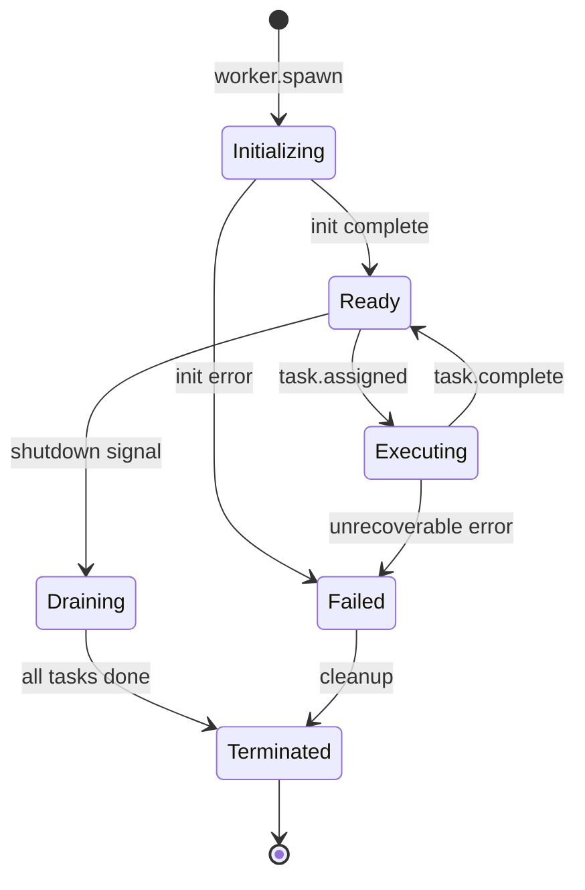

# Execution Layer

The execution layer is where AI agents **do work**. Workers are stateful processes that receive tasks, invoke tools, call LLMs, and produce results — all within a governed sandbox.

---

## Worker Model

A **worker** is the fundamental execution unit in AgentOS — analogous to a process in a traditional OS.

```mermaid
graph TB
    subgraph Worker Process
        LH[Lifecycle Hooks] --> E[Executor]
        E --> LLM[LLM Binding]
        E --> TR[Tool Registry]
        E --> MC[Memory Client]
        TR --> T1[Tool 1]
        TR --> T2[Tool 2]
        TR --> T3[Tool N]
    end

    subgraph Sandbox
        RL[Resource Limits]
        TO[Timeout]
        PG[Policy Guard]
    end

    Worker Process --> Sandbox
```

### Worker Lifecycle



**Lifecycle Hooks:**
| Hook | When | Use Case |
|------|------|----------|
| `onInit()` | Worker spawns | Load models, connect to services |
| `onTask(task)` | Task assigned | Main execution logic |
| `onToolCall(tool, args)` | Before tool invocation | Intercept, log, validate |
| `onToolResult(tool, result)` | After tool returns | Transform, cache, audit |
| `onComplete(result)` | Task succeeds | Cleanup, metrics |
| `onError(error)` | Task fails | Error handling, retry decision |
| `onShutdown()` | Worker stopping | Release resources, flush state |

---

## Worker Clusters

Workers are organized into **clusters** — groups of specialized agents for a business domain.

### Engineering Cluster

| Worker | Model | Tools | Purpose |
|--------|-------|-------|---------|
| `code-generator` | GPT-4o | `file.write`, `git.commit` | Generate code from specs |
| `code-reviewer` | GPT-4o | `github.pr.read`, `github.pr.comment` | Review pull requests |
| `test-runner` | GPT-4o-mini | `shell.exec`, `test.run` | Execute and analyze tests |
| `deployer` | GPT-4o-mini | `k8s.apply`, `docker.build` | Build and deploy services |
| `doc-writer` | GPT-4o | `file.write`, `markdown.render` | Generate documentation |

### Marketing Cluster

| Worker | Model | Tools | Purpose |
|--------|-------|-------|---------|
| `content-writer` | GPT-4o | `file.write`, `seo.analyze` | Create blog posts, copy |
| `seo-analyst` | GPT-4o-mini | `seo.audit`, `analytics.query` | SEO optimization |
| `campaign-manager` | GPT-4o | `email.send`, `slack.post` | Run marketing campaigns |
| `analytics-reporter` | GPT-4o-mini | `analytics.query`, `chart.render` | Generate reports |

### Leadership Cluster

| Worker | Model | Tools | Purpose |
|--------|-------|-------|---------|
| `strategy-analyst` | GPT-4o | `doc.read`, `data.analyze` | Strategic analysis |
| `okr-tracker` | GPT-4o-mini | `spreadsheet.read`, `chart.render` | Track OKR progress |
| `exec-summarizer` | GPT-4o | `doc.read`, `email.draft` | Executive summaries |
| `roadmap-planner` | GPT-4o | `jira.query`, `timeline.render` | Roadmap planning |

---

## Sandboxing

Every worker executes inside a **sandbox** with enforced limits.

```yaml
sandbox:
  resource_limits:
    max_memory_mb: 512
    max_cpu_percent: 50
    max_tokens_per_task: 16000
    max_tool_calls_per_task: 20
    max_concurrent_tools: 3
  timeout:
    task_timeout_ms: 120000
    tool_timeout_ms: 30000
    llm_timeout_ms: 60000
  isolation:
    network: restricted        # only allowlisted endpoints
    filesystem: read-only      # except designated output dirs
    environment: isolated      # per-worker env vars
```

### Resource Enforcement

| Resource | Enforcement Mechanism |
|----------|----------------------|
| Memory | Container memory limits (cgroups) |
| CPU | CPU quota via container runtime |
| Tokens | SDK-level counter with hard cutoff |
| Tool calls | SDK-level counter |
| Time | Deadline propagation via context |
| Network | Network policy / allowlist |

---

## Tool Invocation

Workers invoke tools through a **type-safe registry** with built-in auth, validation, and observability.

```typescript
// Tool invocation flow
const result = await ctx.invokeTool('github.pr.comment', {
  owner: 'myorg',
  repo: 'myrepo',
  pr_number: 42,
  body: 'LGTM! ✅'
});
```

**Invocation Pipeline:**
1. **Validate** — check args against tool schema
2. **Policy Check** — evaluate pre-execution policies
3. **Auth** — inject credentials from secrets store
4. **Execute** — call the tool implementation
5. **Validate Output** — check result against output schema
6. **Audit** — log invocation to audit trail
7. **Trace** — record span in distributed trace

---

## Worker-to-Worker Delegation

Workers can delegate sub-tasks to other workers:

```typescript
// Delegate to another worker
const review = await ctx.delegate('code-reviewer', {
  type: 'review-pr',
  input: { diff: prDiff }
});
```

Delegation creates a child task in the DAG, inheriting the parent's trace context and policy scope.
