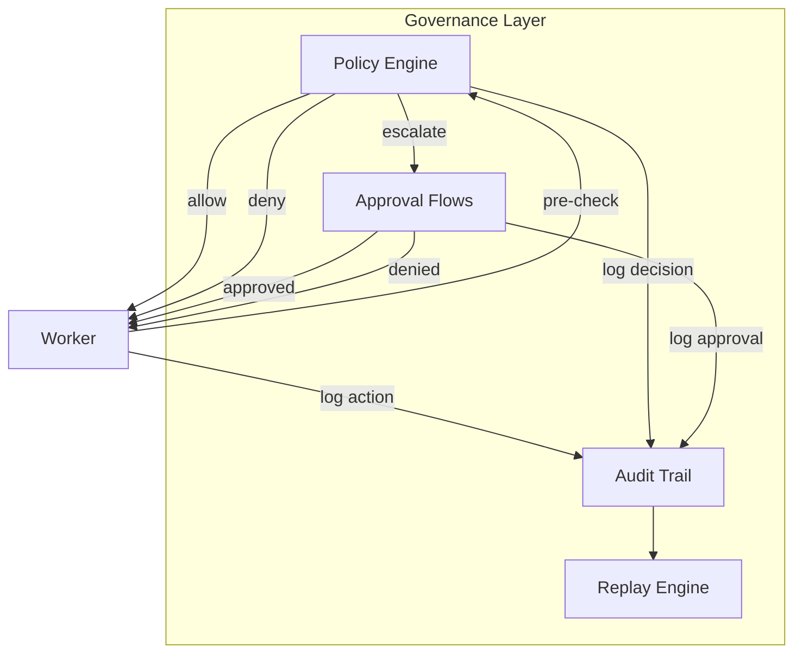
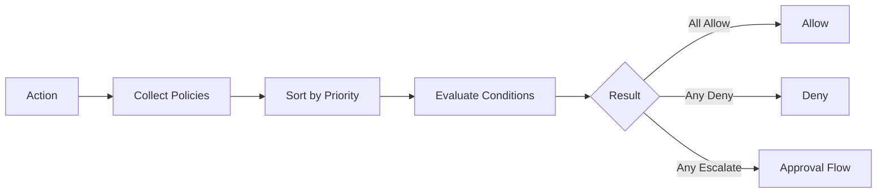
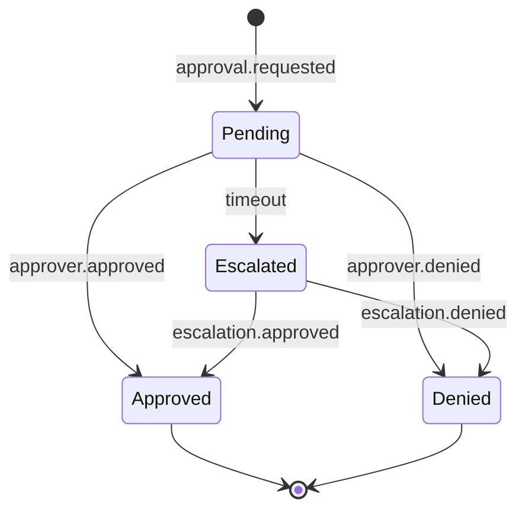

# Governance Layer

The governance layer ensures **safe, auditable, compliant** AI operations. Every action flows through policy evaluation, and every outcome is recorded in an immutable audit trail.

---

## Components



---

## Policy Engine

A rule-based evaluation engine that checks every action against configurable policies.

### Policy Model

```typescript
interface Policy {
  id: string;
  name: string;
  description: string;
  scope: PolicyScope;
  priority: number;              // higher = evaluated first
  condition: PolicyCondition;    // when does this policy apply
  action: PolicyAction;          // what to do when triggered
  enabled: boolean;
  metadata: {
    author: string;
    createdAt: Date;
    version: number;
  };
}

type PolicyScope =
  | { type: 'global' }                           // all workers
  | { type: 'cluster'; cluster: string }          // specific cluster
  | { type: 'worker'; workerId: string }          // specific worker
  | { type: 'tool'; toolName: string }            // specific tool
  | { type: 'workflow'; workflowId: string };     // specific workflow

type PolicyAction =
  | { type: 'allow' }
  | { type: 'deny'; reason: string }
  | { type: 'require_approval'; approvers: string[] }
  | { type: 'rate_limit'; maxPerMinute: number }
  | { type: 'transform'; transformer: string };   // modify the action
```

### Policy DSL (YAML)

```yaml
# policy: no-prod-deploy-without-approval
name: require-approval-for-production
scope:
  type: tool
  tool: k8s.apply
condition:
  all:
    - field: args.namespace
      equals: production
    - field: args.action
      in: [deploy, rollback]
action:
  type: require_approval
  approvers: [engineering-lead, devops-oncall]
  timeout_minutes: 60
  escalation: engineering-director
priority: 100
```

### Evaluation Pipeline



**Evaluation Rules:**
1. Collect all policies matching the action's scope
2. Sort by priority (highest first)
3. Evaluate conditions against the action context
4. First `deny` → action denied (short-circuit)
5. Any `require_approval` → route to approval flow
6. All `allow` (or no matching policies) → action allowed

---

## Approval Flows

Human-in-the-loop gates for high-risk actions.

### Approval Lifecycle



### Approval Routing

| Strategy | Description |
|----------|-------------|
| `any-of` | Any one approver can approve |
| `all-of` | All listed approvers must approve |
| `majority` | Majority must approve |
| `role-based` | Anyone with the specified role |
| `threshold` | Approve if risk score < threshold |

### Notification Channels

- Slack DM / channel message
- Email notification
- In-app dashboard
- Webhook to external systems

---

## Audit Trail

Immutable, append-only log of every action, decision, and outcome.

### Audit Entry

```typescript
interface AuditEntry {
  id: string;
  timestamp: Date;
  type: AuditEntryType;
  actor: {
    type: 'worker' | 'user' | 'system';
    id: string;
    name: string;
  };
  action: {
    type: string;               // e.g., 'tool.invocation', 'policy.evaluation'
    target: string;             // what was acted upon
    input: unknown;
    output: unknown;
    status: 'success' | 'failure' | 'denied';
  };
  context: {
    executionId: string;
    taskId: string;
    workflowId?: string;
    traceId: string;
    tenantId: string;
  };
  policy?: {
    policyId: string;
    decision: 'allow' | 'deny' | 'escalate';
    reason?: string;
  };
}
```

### Query API

```typescript
// Query audit entries
const entries = await audit.query({
  timeRange: { from: '2024-01-01', to: '2024-01-31' },
  actor: { type: 'worker', id: 'code-reviewer' },
  action: { type: 'tool.invocation' },
  limit: 100,
  orderBy: 'timestamp:desc'
});

// Compliance report
const report = await audit.complianceReport({
  period: '2024-Q1',
  includeApprovals: true,
  includeDenials: true,
  format: 'pdf'
});
```

---

## Replay Engine

Deterministic replay of any workflow execution for debugging, testing, and compliance.

**Replay Modes:**
| Mode | Description |
|------|-------------|
| `full` | Replay entire workflow with recorded inputs/outputs |
| `step` | Step-by-step replay with pause/resume |
| `diff` | Replay and compare against original execution |
| `what-if` | Replay with modified inputs or policies |

**Implementation:**
- All events are persisted to the event bus with ordering guarantees
- Replay engine reads events in sequence and re-executes the workflow
- LLM calls use recorded responses (deterministic mode) or live calls (what-if mode)
- Tool calls can be stubbed or replayed from audit trail
