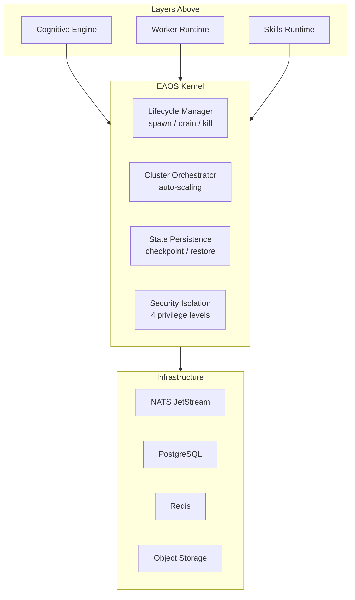

# EAOS Kernel Architecture

## Kernel Components



## Lifecycle Manager

| Operation | Description | Triggers |
|-----------|-------------|----------|
| `spawn` | Create agent with resource quotas | Scheduler dispatch, cluster init |
| `heartbeat` | Update health + resource usage | Agent periodic (10s) |
| `drain` | Finish current, reject new | Rolling restart, scale-down |
| `terminate` | Clean shutdown | Drain complete |
| `kill` | Force stop + optional auto-restart | OOM, token budget, stuck |

**Restart Policies**: `always` (k8s default), `on-failure` (with max retries), `never`

## Cluster Orchestration Auto-Scaling

```
                          ┌──────────────────┐
   Utilization > target ──│  SCALE UP        │
                          │  +25% or +1 min  │
                          └──────────────────┘
                          ┌──────────────────┐
   Utilization < 50% ─────│  SCALE DOWN      │
   of target              │  −1 replica      │
                          └──────────────────┘
                          ┌──────────────────┐
   Within range ──────────│  STEADY          │
                          └──────────────────┘
```

Cooldown period between scaling events prevents thrashing.

## State Persistence

| Trigger | When |
|---------|------|
| Periodic | Every 60s (configurable) |
| Pre-tool | Before risky tool calls |
| Pre-drain | Before graceful shutdown |
| Manual | API-triggered |

Max 5 checkpoints per agent, 24h TTL, automatic GC.

## Security Isolation

| Level | Tools | Secrets | Namespaces | Tool Calls |
|-------|-------|---------|------------|------------|
| `root` | All | All | All | 50 |
| `admin` | All − system.* | All | All | 30 |
| `standard` | read/write/search | app/api | Own | 10 |
| `restricted` | Read only | None | Own | 3 |

All violations are recorded with severity and audit trail.
