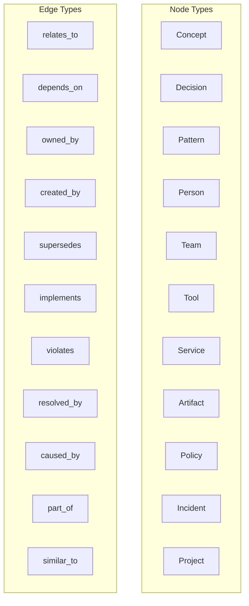

# Institutional Knowledge Graph Architecture

## Graph Structure



## Knowledge Sources

| Source | Node Types Created | Automation |
|--------|-------------------|------------|
| Worker executions | Decision, Pattern | Fully automated |
| Incident postmortems | Incident, Decision | Automated with review |
| Code reviews | Pattern, Artifact | Automated via GitHub |
| Policy evaluations | Policy, Decision | Automated |
| Human annotations | Any | Manual |
| Architecture docs | Concept, Service | Semi-automated |

## Query API

```typescript
// Find all decisions related to deployments
graph.query({
  nodeType: 'decision',
  tags: ['deployment'],
  traverseDepth: 2,
  minConfidence: 0.8,
});

// Find path between an incident and its root cause
graph.findPaths('incident-503-outage', 'service-payment-api', 3);

// Get all patterns discovered by code review
graph.query({
  nodeType: 'pattern',
  query: 'error handling',
});
```

## Knowledge Decay

- Confidence scores decay over time (`-0.01/month` by default)
- Nodes below `0.3` confidence are flagged for review
- Nodes below `0.1` confidence are archived
- Manually pinned nodes are exempt from decay

## Integration with Workers

Workers query the knowledge graph during:
1. **Planning** — find similar past decisions and patterns
2. **Execution** — retrieve relevant context for tool calls
3. **Error recovery** — find how similar errors were resolved
4. **Postmortem** — record new decisions and patterns
