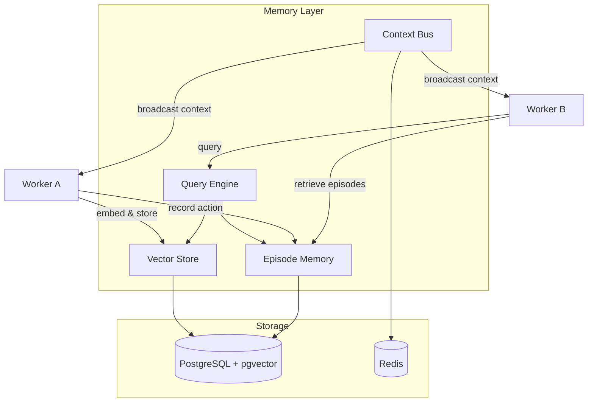
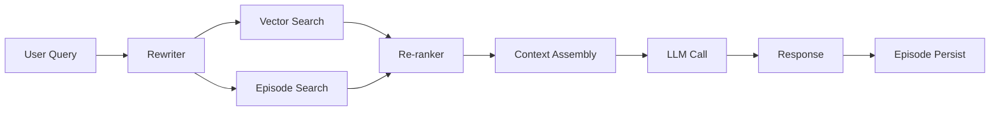

# Memory Layer

The memory layer provides **persistent, queryable context** shared across workers, sessions, and workflow executions. It is the long-term knowledge substrate of AgentOS.

---

## Architecture



---

## Components

### Vector Store

Semantic search over documents, code, conversations, and any structured knowledge.

**Storage Model:**
```typescript
interface VectorDocument {
  id: string;
  namespace: string;           // tenant / project isolation
  content: string;             // original text
  embedding: number[];         // vector representation
  metadata: Record<string, unknown>;
  source: {
    type: 'document' | 'code' | 'conversation' | 'episode';
    uri: string;
    timestamp: Date;
  };
  ttl?: Date;                  // optional expiry
}
```

**Operations:**
| Operation | Description |
|-----------|-------------|
| `upsert(doc)` | Insert or update a document with auto-embedding |
| `search(query, topK)` | Semantic similarity search |
| `searchWithFilter(query, filter, topK)` | Filtered similarity search |
| `delete(id)` | Remove a document |
| `reindex(namespace)` | Re-embed all documents in a namespace |

**Embedding Pipeline:**
1. Content arrives (text, code, structured data)
2. Chunking (recursive character splitter, code-aware for source files)
3. Embedding (OpenAI `text-embedding-3-small` default, pluggable)
4. Storage (pgvector with HNSW index)

### Episode Memory

Temporal sequence of actions and outcomes — the "autobiographical memory" of agents.

**Episode Model:**
```typescript
interface Episode {
  id: string;
  executionId: string;         // workflow execution ID
  workerId: string;
  taskId: string;
  sequence: number;            // order within execution
  action: {
    type: 'llm_call' | 'tool_invocation' | 'delegation' | 'decision';
    input: unknown;
    model?: string;
    toolName?: string;
  };
  result: {
    output: unknown;
    status: 'success' | 'failure';
    durationMs: number;
    tokensUsed?: number;
  };
  context: Record<string, unknown>;  // snapshot of relevant context
  timestamp: Date;
}
```

**Query Patterns:**
```typescript
// Recent episodes for a worker
const episodes = await memory.episodes.query({
  workerId: 'code-reviewer',
  limit: 50,
  orderBy: 'timestamp:desc'
});

// Episodes from a specific execution
const history = await memory.episodes.query({
  executionId: 'exec-123',
  orderBy: 'sequence:asc'
});

// Similar past episodes (for learning / few-shot)
const similar = await memory.episodes.searchSimilar({
  action: currentAction,
  topK: 5,
  minSimilarity: 0.8
});
```

### Context Bus

Real-time context propagation between workers during a workflow execution.

**Use Cases:**
- Worker A discovers a fact → broadcasts to all workers in the execution
- Worker B produces an intermediate result → available to downstream workers
- External event arrives → injected into active execution context

**Implementation:**
- Redis Pub/Sub for real-time broadcast
- Execution-scoped channels (`ctx:{executionId}`)
- Auto-cleanup on execution completion

```typescript
// Publish context update
await ctx.broadcast('discovered-api-key-rotation', {
  service: 'auth-service',
  rotatedAt: new Date(),
  newKeyPrefix: 'sk-new-'
});

// Subscribe to context updates
ctx.onContext('discovered-*', (update) => {
  // React to new context
});
```

---

## RAG Pipeline

Workers use a **Retrieval-Augmented Generation** pipeline for context-aware LLM calls.



**Pipeline Steps:**
1. **Query Rewriting** — reformulate for better retrieval
2. **Multi-Source Retrieval** — parallel search across vector store + episodes
3. **Re-ranking** — cross-encoder re-ranking for precision
4. **Context Assembly** — format retrieved chunks within token budget
5. **LLM Call** — generate response with retrieved context
6. **Episode Persist** — save the action-result pair

---

## Garbage Collection

Memory is not infinite. AgentOS implements TTL-based and policy-based GC:

| Strategy | Description |
|----------|-------------|
| TTL | Documents expire after configurable time |
| LRU | Least recently accessed documents evicted first |
| Relevance decay | Embedding similarity threshold increases over time |
| Namespace quota | Per-namespace storage limits with eviction |
| Manual purge | API for explicit deletion |

---

## Configuration

```yaml
memory:
  vector_store:
    backend: pgvector
    embedding_model: text-embedding-3-small
    embedding_dimensions: 1536
    chunk_size: 512
    chunk_overlap: 50
    index_type: hnsw
    ef_construction: 128
    m: 16

  episodes:
    backend: postgresql
    max_episodes_per_execution: 10000
    retention_days: 90

  context_bus:
    backend: redis
    channel_prefix: "ctx:"
    message_ttl_seconds: 3600

  garbage_collection:
    enabled: true
    interval_hours: 24
    default_ttl_days: 30
```
