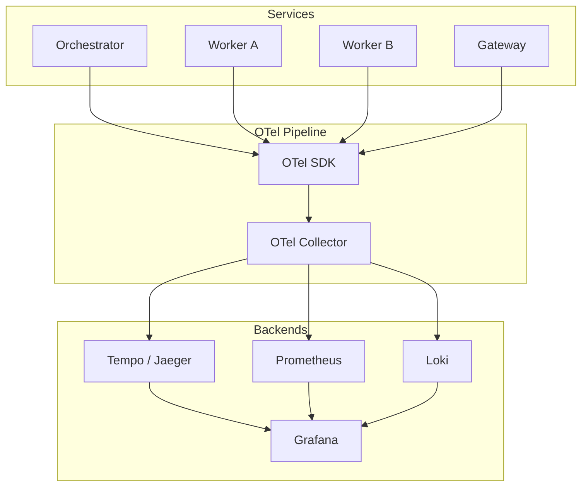

# Observability Layer

Full visibility into the agent runtime — distributed tracing, metrics, and dashboards powered by OpenTelemetry.

---

## Architecture



---

## Distributed Tracing

Every goal execution produces a **distributed trace** that spans the entire lifecycle.

### Trace Structure

```
Goal Execution (root span)
├── Planning (span)
│   └── LLM Call: decompose goal (span)
├── Task: lint (span)
│   ├── Tool: static_analysis.run (span)
│   └── LLM Call: analyze results (span)
├── Task: test (span)
│   ├── Tool: shell.exec (span)
│   └── LLM Call: interpret output (span)
├── Task: review (span)
│   ├── Tool: github.pr.read (span)
│   ├── LLM Call: review code (span)
│   ├── Policy: pre-merge-check (span)
│   └── Tool: github.pr.comment (span)
└── Task: deploy (span)
    ├── Approval: await (span)
    ├── Tool: k8s.apply (span)
    └── Tool: slack.notify (span)
```

### Span Attributes

| Attribute | Description | Example |
|-----------|-------------|---------|
| `agentos.goal.id` | Goal execution ID | `goal-abc123` |
| `agentos.task.id` | Task ID | `task-def456` |
| `agentos.worker.id` | Worker ID | `code-reviewer` |
| `agentos.worker.cluster` | Worker cluster | `engineering` |
| `agentos.tool.name` | Tool being invoked | `github.pr.comment` |
| `agentos.llm.model` | LLM model used | `gpt-4o` |
| `agentos.llm.tokens.input` | Input tokens | `2048` |
| `agentos.llm.tokens.output` | Output tokens | `512` |
| `agentos.policy.id` | Policy evaluated | `require-approval` |
| `agentos.policy.decision` | Policy decision | `allow` |

---

## Metrics

### Core Metrics

| Metric | Type | Labels | Description |
|--------|------|--------|-------------|
| `agentos_goals_total` | Counter | `status` | Total goals submitted |
| `agentos_tasks_total` | Counter | `status`, `cluster`, `worker` | Total tasks executed |
| `agentos_task_duration_ms` | Histogram | `cluster`, `worker` | Task execution time |
| `agentos_tool_calls_total` | Counter | `tool`, `status` | Tool invocations |
| `agentos_tool_duration_ms` | Histogram | `tool` | Tool call latency |
| `agentos_llm_calls_total` | Counter | `model`, `worker` | LLM API calls |
| `agentos_llm_tokens_total` | Counter | `model`, `type` (in/out) | Token consumption |
| `agentos_llm_duration_ms` | Histogram | `model` | LLM call latency |
| `agentos_policy_evaluations_total` | Counter | `policy`, `decision` | Policy checks |
| `agentos_approvals_total` | Counter | `status` | Approval requests |
| `agentos_events_total` | Counter | `type` | Events published |
| `agentos_memory_queries_total` | Counter | `type` (vector/episode) | Memory queries |

### Resource Metrics

| Metric | Type | Description |
|--------|------|-------------|
| `agentos_workers_active` | Gauge | Currently running workers |
| `agentos_queue_depth` | Gauge | Tasks waiting in scheduler |
| `agentos_memory_documents` | Gauge | Documents in vector store |
| `agentos_llm_cost_usd` | Counter | Estimated LLM cost |

---

## Dashboards

### Operations Dashboard
- Goal throughput (submitted/completed/failed per minute)
- Active workers by cluster
- Scheduler queue depth
- Error rate and top errors
- P50/P95/P99 task latency

### Cost Dashboard
- Token usage by model, worker, cluster
- Estimated cost per goal
- Cost trends over time
- Budget utilization

### Governance Dashboard
- Policy evaluations (allow/deny/escalate)
- Pending approvals
- Audit trail activity
- Compliance metrics

---

## Alerting

| Alert | Condition | Severity |
|-------|-----------|----------|
| High error rate | `error_rate > 5%` for 5 min | Critical |
| Latency spike | `p99 > 30s` for 10 min | Warning |
| Queue backup | `queue_depth > 100` for 5 min | Warning |
| Budget exceeded | `daily_cost > $100` | Critical |
| Worker crash loop | `restart_count > 3` in 10 min | Critical |
| Approval timeout | `pending > 60 min` | Warning |
| Memory high usage | `documents > 90% quota` | Warning |

---

## Configuration

```yaml
observability:
  tracing:
    enabled: true
    exporter: otlp
    endpoint: http://otel-collector:4317
    sample_rate: 1.0                # 100% in dev, tune for prod

  metrics:
    enabled: true
    exporter: prometheus
    port: 9090
    path: /metrics
    collection_interval_ms: 15000

  logging:
    level: info
    format: json
    exporter: loki
    endpoint: http://loki:3100

  dashboards:
    provider: grafana
    auto_provision: true
    templates_dir: ./dashboards/
```
