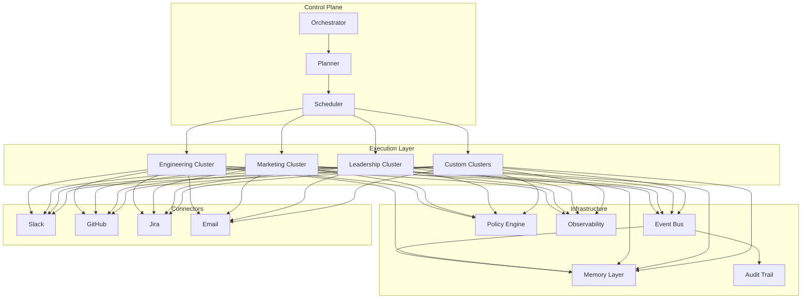
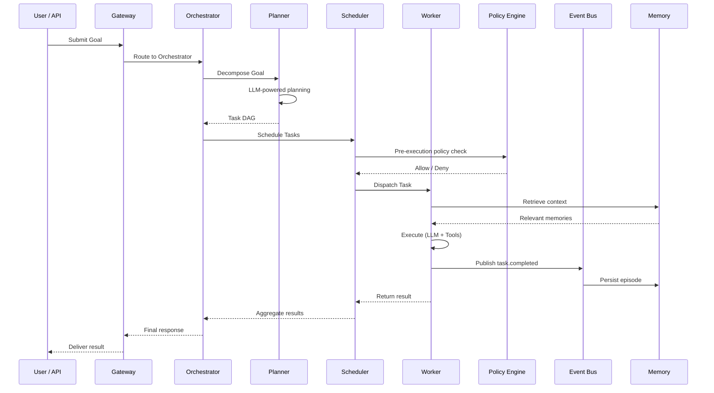

# AgentOS — System Architecture Overview

## Design Principles

1. **Agent-Native** — Everything is designed around autonomous agent processes, not human UIs
2. **Policy-First** — Every action is governed by composable policy rules
3. **Event-Driven** — All state changes propagate through an immutable event bus
4. **Observable** — Full distributed tracing from goal to outcome
5. **Extensible** — New workers, connectors, and policies without core changes

---

## Layer Architecture

---

## Request Lifecycle

---

## Data Flow

| Flow | Source | Destination | Transport |
|------|--------|-------------|-----------|
| Goal submission | API Gateway | Orchestrator | gRPC / REST |
| Task dispatch | Scheduler | Worker | Event Bus |
| Tool invocation | Worker | External API | HTTP / SDK |
| Context retrieval | Worker | Memory | gRPC |
| Event propagation | Any service | Event Bus | NATS / Kafka |
| Policy evaluation | Worker | Policy Engine | In-process / gRPC |
| Trace export | All services | Observability | OTLP |

---

## Technology Choices

| Component | Default | Alternatives |
|-----------|---------|-------------|
| Language | TypeScript | — |
| Runtime | Node.js 20+ | Bun |
| Event Bus | NATS JetStream | Kafka, Redis Streams |
| Vector Store | pgvector | Qdrant, Pinecone |
| Relational DB | PostgreSQL | — |
| Cache | Redis | — |
| Observability | OpenTelemetry + Grafana | Datadog |
| Container | Docker + K8s | — |
| CI/CD | GitHub Actions | — |

---

## Cross-Cutting Concerns

### Authentication & Authorization
- API keys for external clients
- JWT for internal service-to-service
- Role-based access control (RBAC) for multi-tenant

### Configuration
- Environment variables for secrets
- YAML manifests for workers, workflows, policies
- Feature flags for gradual rollout

### Error Handling
- Structured error types with codes
- Retry with exponential backoff
- Dead-letter queues for unprocessable events
- Circuit breakers for external services

See individual layer documents for detailed designs:
- [Control Plane](./control-plane.md)
- [Execution Layer](./execution-layer.md)
- [Memory Layer](./memory-layer.md)
- [Governance Layer](./governance-layer.md)
- [Observability Layer](./observability-layer.md)
- [Event Bus](./event-bus.md)
- [Agent Protocol](./agent-protocol.md)
