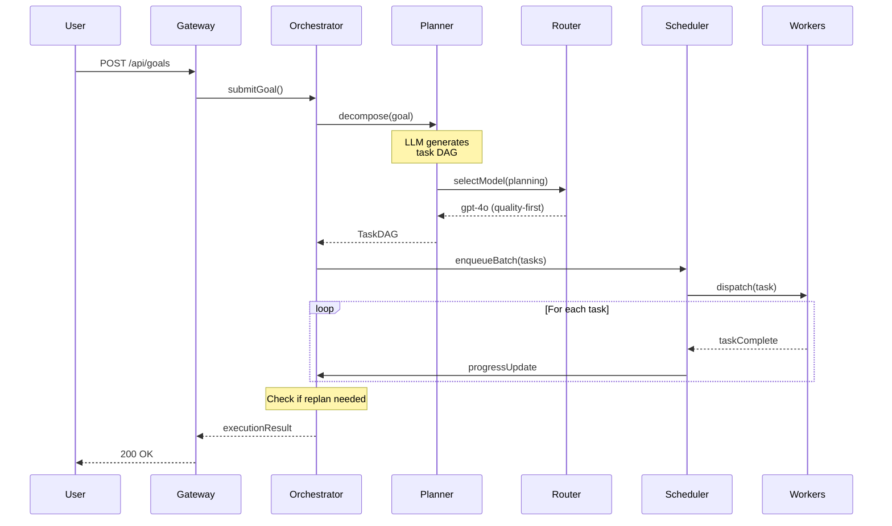

# Orchestrator Planning Model

## Planning Pipeline



## Goal Decomposition

The planner uses a structured prompt to decompose high-level goals into executable task DAGs:

```
System: You are an AI task planner for an enterprise agent OS.
Given a high-level goal, decompose it into a DAG of concrete tasks.

Rules:
- Each task must have: id, type, worker, input, dependsOn
- Minimize task count (prefer fewer, well-scoped tasks)
- Parallelize independent tasks
- Mark approval gates for risky actions
- Estimate token usage per task

Goal: {goal_description}
Context: {available_workers, recent_history, policies}

Output: JSON TaskDAG
```

## Replan Strategy

| Trigger | Action |
|---------|--------|
| Task failure (retryable) | Retry with backoff |
| Task failure (non-retryable) | Replan remaining DAG |
| New information mid-execution | Replan with updated context |
| Approval denied | Replan without blocked action |
| Max replans exceeded (3) | Fail execution |

## Plan Quality Metrics

| Metric | Target |
|--------|--------|
| Tasks per goal | 2-8 (avoid over-decomposition) |
| Max DAG depth | ≤ 5 levels |
| Parallelism ratio | > 0.3 (30% parallel) |
| Planning latency | < 5 seconds |
| Replan rate | < 15% of executions |
