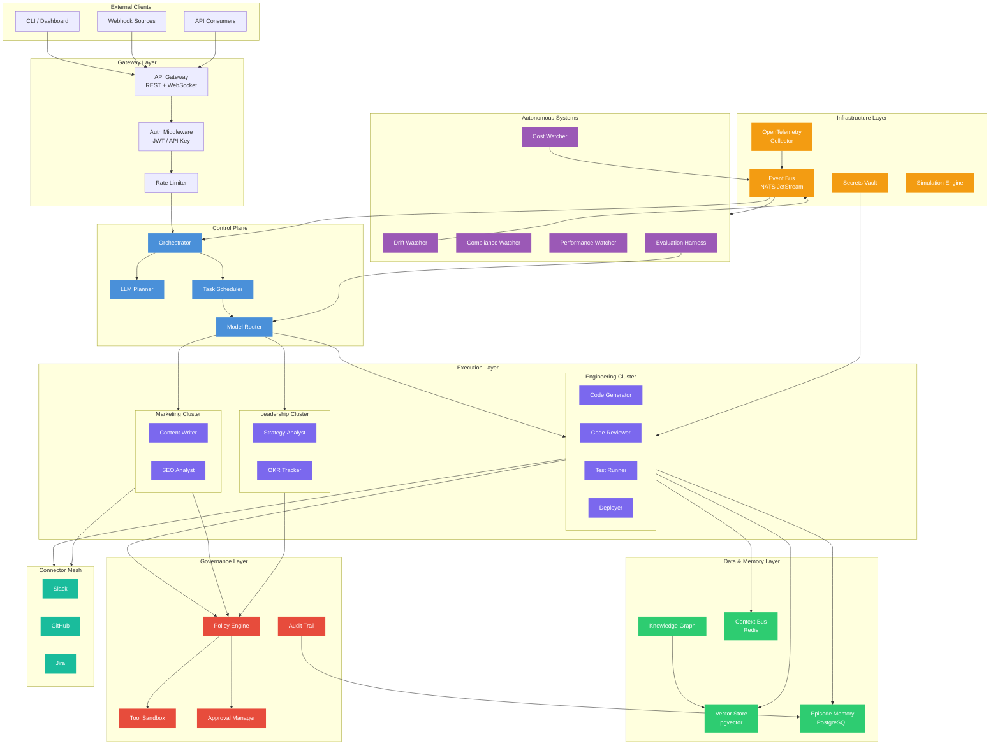

# EAOS Service Architecture Diagram

## Service Topology



## Service Communication Matrix

| From → To | Protocol | Pattern | Latency |
|-----------|----------|---------|---------|
| Gateway → Orchestrator | gRPC | Request/Reply | <10ms |
| Orchestrator → Scheduler | In-process | Direct call | <1ms |
| Scheduler → Workers | Event Bus | Async dispatch | <50ms |
| Workers → Tools | HTTP/gRPC | Request/Reply | 100-5000ms |
| Workers → Memory | gRPC | Request/Reply | <20ms |
| Workers → Policy Engine | In-process | Sync eval | <5ms |
| Event Bus → Watchers | NATS | Pub/Sub | <10ms |
| Workers → Connectors | HTTP | Request/Reply | 200-2000ms |
| Evaluation → Router | In-process | Feedback loop | async |

## Deployment Model

```
┌─────────────────────────────────────────────────────┐
│  Kubernetes Cluster                                  │
│                                                      │
│  ┌─────────┐  ┌──────────────┐  ┌────────────────┐ │
│  │ Gateway  │  │ Orchestrator │  │ Memory Service │ │
│  │ (HPA)   │  │ (1 replica)  │  │ (StatefulSet)  │ │
│  └─────────┘  └──────────────┘  └────────────────┘ │
│                                                      │
│  ┌──────────────────────────────────────────────┐   │
│  │ Worker Pool (HPA, 0→100 replicas)            │   │
│  │ ┌─────┐ ┌─────┐ ┌─────┐ ┌─────┐ ┌─────┐   │   │
│  │ │ Eng │ │ Eng │ │ Mkt │ │Lead │ │ Eng │   │   │
│  │ └─────┘ └─────┘ └─────┘ └─────┘ └─────┘   │   │
│  └──────────────────────────────────────────────┘   │
│                                                      │
│  ┌─────────┐ ┌──────┐ ┌──────────┐ ┌───────────┐  │
│  │  NATS   │ │Redis │ │PostgreSQL│ │ OTel      │  │
│  │JetStream│ │      │ │+ pgvector│ │ Collector │  │
│  └─────────┘ └──────┘ └──────────┘ └───────────┘  │
└─────────────────────────────────────────────────────┘
```

## Port Assignments

| Service | Port | Protocol |
|---------|------|----------|
| Gateway (REST) | 3000 | HTTP |
| Gateway (WebSocket) | 3000 | WS |
| Orchestrator (gRPC) | 3001 | gRPC |
| Memory Service | 3002 | gRPC |
| NATS | 4222 | NATS |
| PostgreSQL | 5432 | TCP |
| Redis | 6379 | TCP |
| OTel Collector | 4317 | gRPC |
| Prometheus | 9090 | HTTP |
| Grafana | 3003 | HTTP |
