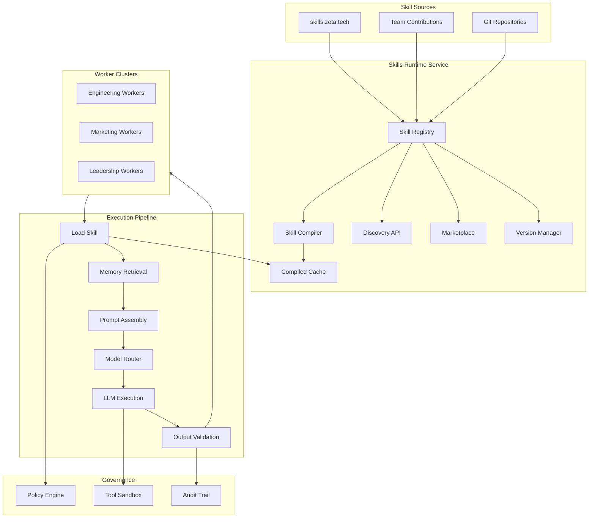

# Skills Runtime Architecture

## Skills as First-Class Runtime Components



## Skill Module Definition

A **Skill Module** is:
- A **reusable prompt capability** (not just text — a full execution config)
- **Versioned** with semantic versioning
- **Testable** via evaluation suites
- **Bound to workers** via compatibility declarations
- **Governed by policy** (guardrails, tool restrictions, rate limits)
- **Executable** inside workflows as first-class steps

## Execution Pipeline

```
Worker receives task
    ↓
1. LOAD SKILL     — Fetch compiled skill from cache or compile on demand
    ↓
2. MEMORY RETRIEVAL — Query vector store + knowledge graph for context
    ↓
3. PROMPT ASSEMBLY  — Merge: skill prompt + context + tools + safety constraints
    ↓
4. MODEL ROUTING    — Select optimal LLM based on domain, complexity, budget
    ↓
5. LLM EXECUTION   — Execute assembled prompt with tool access
    ↓
6. OUTPUT VALIDATION — Validate against output schema, extract citations
    ↓
7. RECORD USAGE     — Log metrics, update quality scores, feed evaluation
```

## Compiler Pipeline

```
raw prompt
    ↓
validation (structure, length, required fields)
    ↓
identity section (skill name, domain, version)
    ↓
tool injection (allowed tools listed)
    ↓
memory hooks (namespaces, knowledge types)
    ↓
output schema (JSON Schema enforcement)
    ↓
safety constraints (guardrails → rules)
    ↓
compiled prompt (hash for cache key)
```

## Skill Versioning

| Operation | Effect |
|-----------|--------|
| `register` | Creates v1.0.0 |
| `publish` | Deactivates previous, activates new version |
| `rollback` | Reactivates a previous version |
| `deprecate` | Marks skill for removal, warns users |

## Skill Marketplace (Internal)

| Team | Skills |
|------|--------|
| Engineering | `pr_architecture_review`, `incident_root_cause`, `runbook_generation` |
| Marketing | `campaign_strategy`, `icp_analysis`, `seo_content_optimization` |
| Leadership | `strategy_analysis`, `decision_summary` |

## Observability

| Metric | Description |
|--------|-------------|
| `skill_usage_total` | Total executions by skill, version, worker |
| `skill_latency_ms` | Execution latency histogram |
| `skill_failure_rate` | Failure rate gauge |
| `skill_eval_score` | Latest evaluation score |
| `skill_token_usage` | Token consumption by model |
| `skill_cache_hit_rate` | Compiled skill cache efficiency |

## Integration with Enterprise Knowledge

Skills Runtime connects to these knowledge sources:

| Source | Integration | Use |
|--------|-------------|-----|
| Confluence | Memory (vector) | Past decisions, architecture docs |
| Jira | Connector + Memory | Issue context, sprint data |
| GitHub | Connector + Memory | Code, PRs, architecture |
| Office transcripts | Memory (vector) | Meeting context, decisions |
| Blogs / Microsites | Memory (vector) | Marketing content, thought leadership |
