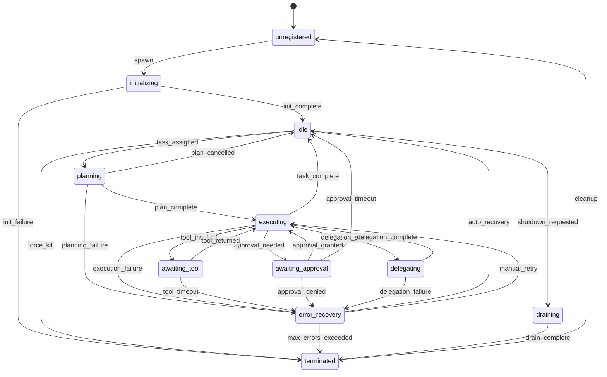

# Agent State Machine Model

## State Diagram



## State Definitions

| State | Description | Billable | Entry Conditions |
|-------|-------------|----------|-----------------|
| `unregistered` | Not yet part of the runtime | No | Initial / after cleanup |
| `initializing` | Loading model, connecting services | No | Spawn command |
| `idle` | Ready to accept tasks | No | Init complete / task done |
| `planning` | LLM is decomposing the task | Yes | Task assigned |
| `executing` | Running task logic | Yes | Plan ready |
| `awaiting_tool` | Blocked on external tool call | Yes | Tool invoked |
| `awaiting_approval` | Blocked on human approval | No | Policy requires approval |
| `delegating` | Waiting for delegated sub-task | Yes | Delegation dispatched |
| `error_recovery` | Attempting recovery from failure | No | Any failure transition |
| `draining` | Finishing current work before shutdown | Yes | Shutdown requested |
| `terminated` | Stopped, resources released | No | Drain complete / fatal error |

## Transition Rules

1. **No skipping states** — transitions must follow the graph
2. **Circuit breaker** — 5 consecutive errors → forced `terminated`
3. **Stuck detection** — executing > 5min with no progress → `error_recovery`
4. **Graceful shutdown** — always goes through `draining` before `terminated`
5. **Auto-recovery** — `error_recovery` → `idle` if errors < threshold

## Resource Lifecycle

```
spawn → initialize → [idle ⟷ executing] → drain → terminate → cleanup
         ↑                     ↓
    allocate model        release model
    connect services      close connections
    warm cache            flush state
```
