# EAOS Internal System Architecture Map

## Full Stack — How Every Layer Connects

```mermaid
graph TB
    subgraph CLIENT["Client Layer"]
        WEB["Mission Control<br/>Next.js :3010"]
        SLACK["Slack @eaos"]
        TEAMS["Teams @eaos"]
        CLI_["eaos CLI"]
        GH_WH["GitHub Webhooks"]
        JIRA_WH["Jira Webhooks"]
    end

    subgraph GATEWAY["Gateway Layer"]
        GW["API Gateway :3000<br/>Auth + Rate Limit"]
    end

    subgraph PRODUCT["Product Layer"]
        WA["Workspace API :3008<br/>Sessions + Progress"]
        CAPS["Capability Discovery"]
        STREAM["Response Streamer<br/>12 event types"]
        NOTIF["Notifications"]
    end

    subgraph COGNITIVE["Cognitive Layer"]
        CE["Cognitive Engine :3005<br/>8-stage pipeline"]
        RL["Reasoning Loop<br/>think→plan→act→reflect"]
        DB["Debate Engine<br/>multi-persona"]
        HG["Hallucination Guard<br/>6-stage check"]
        RE["Reliability Engine :3006<br/>6 validation checks"]
        LE["Learning Engine :3007<br/>feedback + improvement"]
    end

    subgraph DOMAIN["Domain Layer"]
        MKT["Marketing Agent<br/>12 actions"]
        ENG["Engineering Agent<br/>12 actions"]
        LRN["Learning Agent<br/>10 actions"]
        XD["Cross-Domain Flow<br/>4 automated flows"]
    end

    subgraph EXECUTION["Execution Layer"]
        ORCH["Orchestrator :3001"]
        SCHED["Scheduler<br/>5 algorithms"]
        SR["Skills Runtime :3004<br/>compile + execute"]
        MR["Model Router<br/>4 strategies"]
        SAND["Tool Sandbox"]
    end

    subgraph KERNEL["EAOS Kernel"]
        LM["Lifecycle Manager<br/>spawn/drain/kill"]
        CO["Cluster Orchestrator<br/>auto-scaling"]
        SP["State Persistence<br/>checkpoint/restore"]
        SI["Security Isolation<br/>4 privilege levels"]
    end

    subgraph WORKERS["Worker Clusters"]
        W_ENG["Engineering Workers<br/>code-reviewer · deployer"]
        W_MKT["Marketing Workers<br/>campaign-manager · content-writer"]
        W_LEAD["Leadership Workers<br/>strategy-analyst · exec-summarizer"]
    end

    subgraph DATA["Data Layer"]
        MEM["Memory Service :3002"]
        MP["Memory Pipeline<br/>vector+keyword+graph"]
        KG["Knowledge Graph"]
        VEC["pgvector"]
    end

    subgraph OBSERVE["Observability"]
        TRACE["Agent Tracer<br/>hierarchical spans"]
        OTEL["OTel Collector"]
        PROM["Prometheus"]
        GRAF["Grafana :3003"]
    end

    subgraph CONNECTORS["Connector Mesh"]
        C_SLACK["Slack API"]
        C_GH["GitHub API"]
        C_JIRA["Jira API"]
        C_HSPT["HubSpot"]
        C_GA4["GA4"]
        C_CONF["Confluence"]
    end

    subgraph INFRA["Infrastructure"]
        PG["PostgreSQL 16"]
        REDIS["Redis 7"]
        NATS["NATS JetStream"]
        VAULT["Secrets Vault"]
    end

    %% Client → Gateway
    WEB --> GW
    SLACK --> GW
    TEAMS --> GW
    CLI_ --> GW
    GH_WH --> GW
    JIRA_WH --> GW

    %% Gateway → Product
    GW --> WA
    GW --> ORCH
    WA --> STREAM
    WA --> CAPS
    WA --> NOTIF

    %% Product → Cognitive
    ORCH --> CE
    CE --> RL
    CE --> DB
    CE --> HG
    CE --> RE
    CE --> LE

    %% Cognitive → Domain
    CE --> MKT
    CE --> ENG
    CE --> LRN
    MKT --> XD
    ENG --> XD
    LRN --> XD

    %% Domain → Execution
    MKT --> SR
    ENG --> SR
    LRN --> SR
    ORCH --> SCHED
    SCHED --> MR
    MR --> WORKERS
    SR --> SAND

    %% Execution → Kernel
    SCHED --> LM
    LM --> CO
    CO --> SP
    SI --> SAND

    %% Workers → Data
    W_ENG --> MEM
    W_MKT --> MEM
    W_LEAD --> MEM
    MEM --> MP
    MP --> VEC
    MP --> KG

    %% Workers → Connectors
    W_ENG --> C_GH
    W_ENG --> C_JIRA
    W_MKT --> C_HSPT
    W_MKT --> C_GA4
    W_LEAD --> C_CONF
    W_ENG --> C_SLACK

    %% Observability
    CE --> TRACE
    TRACE --> OTEL
    OTEL --> PROM
    PROM --> GRAF

    %% Infrastructure
    MEM --> PG
    MEM --> REDIS
    ORCH --> NATS
    SI --> VAULT
```



## Request Flow (End-to-End)

```
1. User: @eaos create campaign for community banks
2. Gateway: Auth → Rate limit → Route
3. Workspace API: Create session → Start streaming
4. Orchestrator: Dispatch to Cognitive Engine
5. Cognitive Engine:
   a. Decompose goal → 5 tasks
   b. Plan execution order
   c. Reason about approach
6. Scheduler: Select workers → Route to models
7. Workers execute:
   a. ICP Analysis (campaign-manager + marketing.icp_analysis)
   b. Market Research (seo-analyst + GA4 tool)
   c. Strategy Generation (content-writer + marketing.campaign_strategy)
   d. Content Calendar + Email Sequence
8. Each step:
   - Memory Pipeline retrieves context
   - Skills Runtime compiles prompt
   - Model Router selects LLM
   - Sandbox executes tool calls
   - Reliability Engine validates output
   - Hallucination Guard checks claims
9. Learning Engine: Capture feedback (async)
10. Workspace API: Stream progress → Deliver result
11. User sees: Structured output + confidence + sources
```

## Service Registry

| Service | Port | Layer | Connects To |
|---------|------|-------|-------------|
| Gateway | 3000 | Gateway | All services |
| Orchestrator | 3001 | Execution | CE, Scheduler, NATS |
| Memory | 3002 | Data | PG, Redis, pgvector |
| Grafana | 3003 | Observability | Prometheus |
| Skills Runtime | 3004 | Execution | Sandbox, NATS |
| Cognitive Engine | 3005 | Cognitive | Memory, Skills, RE |
| Reliability Engine | 3006 | Cognitive | — |
| Learning Engine | 3007 | Cognitive | Skills, NATS |
| Workspace API | 3008 | Product | CE, Streaming |
| Mission Control | 3010 | Client | Gateway (API) |

## Package Dependency Graph

```
sdk (foundation)
 ├─ events ← runtime, scheduler, watchers, services
 ├─ schemas ← all packages
 ├─ policy ← sandbox, kernel
 │
 ├─ runtime ← scheduler, kernel
 ├─ scheduler ← orchestrator
 ├─ graph ← orchestrator
 ├─ router ← scheduler, cognitive
 │
 ├─ sandbox ← workers, kernel
 ├─ secrets ← kernel, connectors
 │
 ├─ knowledge ← memory-pipeline
 ├─ memory-pipeline ← memory service, domain-agents
 │
 ├─ skills ← skills-runtime, domain-agents
 ├─ cognition ← cognitive-engine
 ├─ evaluation ← learning-engine
 ├─ simulation ← cognitive-engine
 │
 ├─ observability ← all services
 ├─ streaming ← workspace-api, connectors
 ├─ output-schemas ← domain-agents, connectors
 │
 ├─ domain-agents ← cognitive-engine
 ├─ kernel ← all services
 ├─ cli ← (standalone)
 │
 └─ web (Next.js app) ← Gateway API
```
