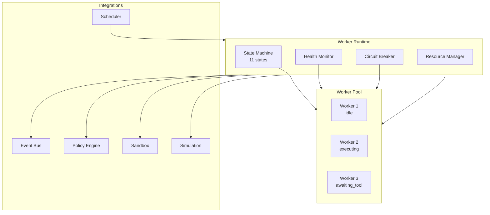

# Worker Runtime Architecture

## Runtime Components



## Worker Lifecycle

```
1. SPAWN       → Allocate resources, assign ID
2. INITIALIZE  → Load model, connect tools, warm cache
3. IDLE        → Park in pool, await dispatch
4. DISPATCH    → Scheduler assigns task, transition to planning
5. EXECUTE     → Run task with ExecutionContext
6. COMPLETE    → Record result, emit event, return to idle
7. DRAIN       → Finish current task, reject new ones
8. TERMINATE   → Release resources, deregister
```

## Health Check Protocol

| Check | Interval | Failure Action |
|-------|----------|----------------|
| Heartbeat | 10s | Mark unhealthy after 3 misses |
| Stuck detection | 30s | Force recovery after 5min |
| Memory usage | 10s | Kill if > sandbox limit |
| Error rate | 10s | Circuit break if > 5 consecutive |
| Token consumption | per-task | Fail task if over budget |

## Circuit Breaker

```
consecutive_errors >= 5  →  error_recovery
error_recovery timeout   →  terminated (auto-restart)
manual reset             →  idle
```

## Resource Limits (per worker)

| Resource | Default Limit | Configurable |
|----------|--------------|-------------|
| Memory | 512 MB | ✅ |
| CPU | 25% | ✅ |
| Tokens per task | 8,000 | ✅ |
| Tool calls per task | 20 | ✅ |
| Concurrent connections | 10 | ✅ |
| Task timeout | 300s | ✅ |
